# 🏗️ OVHL CORE - ARSITEKTUR SISTEM

## 📋 INFORMASI DOKUMEN

| Properti            | Nilai                                             |
| ------------------- | ------------------------------------------------- |
| **ID Dokumen**      | `ARC-001`                                         |
| **Versi Dokumen**   | `1.1.3`                                           |
| **Status**          | `Aktif (Telah Direvisi)`                          |
| **Lokasi Path**     | `./docs/01_CORE_FRAMEWORK/1.3_ARSITEKTUR_INTI.md` |
| **Repository**      | `https://github.com/ovhlstudio/ovhl-roblox`       |
| **Lisensi**         | `MIT`                                             |
| **Tipe Framework**  | `Service-Oriented, Event-Driven, Auto-Discovery`  |
| **Target Audiens**  | `Core Dev, Module Dev, AI Assistant`              |
| **Relasi**          | `Source of Truth (Master Blueprint)`              |
| **Penulis**         | `OVHL Core Team`                                  |
| **Dibuat Tanggal**  | `27 Oktober 2025`                                 |
| **Update Terakhir** | `28 Oktober 2025`                                 |

---

## 🎯 1. FILOSOFI & VISI INTI

Arsitektur OVHL Core dirancang sebagai framework _modular_ yang _scalable_ dan _developer-friendly_ untuk Roblox.

Tujuannya adalah menggabungkan kekuatan arsitektur _Service-Oriented (SOA)_ dan _Component-Based UI (CBUI)_ yang _native_ di atas Roblox Luau.

Visi utamanya adalah menghilangkan _boilerplate_ (kode berulang) dan mempermudah developer awam melalui tiga pilar utama:

1.  **Auto-Discovery:** Modul dan servis "tinggal-taruh" dan langsung dikenali.
2.  **Modularitas:** Pemisahan yang jelas antara _Core_ (layanan inti) dan _Modules_ (fitur game).
3.  **Integrasi AI:** Dokumentasi yang terstruktur agar AI dapat membantu pengembangan.

<details>
<summary>🇬🇧 English Version</summary>

## 🎯 1. CORE PHILOSOPHY & VISION

The OVHL Core architecture is designed as a modular, scalable, and developer-friendly framework for Roblox.

Its goal is to combine the strengths of Service-Oriented Architecture (SOA) and Component-Based UI (CBUI), natively implemented on Roblox Luau.

The main vision is to eliminate boilerplate code and simplify development for beginners through three key pillars:

1.  **Auto-Discovery:** Modules and services are automatically detected just by placing them in the correct folder.
2.  **Modularity:** Clear separation between the _Core_ (essential services) and _Modules_ (game features).
3.  **AI Integration:** Structured documentation to enable AI assistance in development.

</details>

---

## 🔑 2. GLOBAL ACCESSOR `OVHL` (BARU)

Untuk menyederhanakan interaksi bagi _module developer_, semua _core system_ diekspos melalui satu _global accessor_ (atau modul bersama) bernama `OVHL`. Ini adalah satu-satunya "pintu masuk" yang perlu diketahui oleh developer.

**Prinsip Desain:**

- **Satu Titik Akses:** Developer tidak perlu me-`require` `ServiceManager`, `EventBus`, `StateManager`, `RemoteClient` secara manual.
- **API Sederhana:** Menyediakan _shortcut_ API yang jelas dan konsisten di Server dan Client.

**Contoh Penggunaan (Kode di Modul):**

```lua
-- ===================================================
-- CONTOH DI SERVER (misal: ExampleModule.lua)
-- ===================================================

-- Cukup require 'OVHL'
local OVHL = require(game.ReplicatedStorage.OVHL_Shared.OVHL_Global) -- (Contoh path)

function ExampleModule:Start()
    -- Panggil service lewat OVHL
    local Logger = OVHL:GetService("Logger") --
    Logger:Info("Module started!")

    -- Emit event internal server lewat OVHL
    OVHL:Emit("ModuleStarted", self.name) --

    -- Ambil config default atau live
    local myConfig = OVHL:GetConfig("ExampleModule") --
end
```

```lua
-- ===================================================
-- CONTOH DI CLIENT (misal: HUD.lua)
-- ===================================================

-- Cukup require 'OVHL'
local OVHL = require(game.ReplicatedStorage.OVHL_Shared.OVHL_Global) -- (Contoh path)

function HUD:DidMount()
    -- Dengerin state change lewat OVHL
    OVHL:Subscribe("coins", function(newCoins) --
        self:SetState({ coins = newCoins })
    end)
end

function HUD:OnBuyButtonPress()
    -- Panggil server lewat OVHL (Aman)
    local result = OVHL:Invoke("BeliItem", "Sword") --

    if result.success then
        -- Update state client lewat OVHL
        OVHL:SetState("coins", result.newCoins) --
    end
end
```

<details>
<summary>🇬🇧 English Version</summary>

## 🔑 2. THE `OVHL` GLOBAL ACCESSOR (NEW)

To simplify interaction for module developers, all core systems are exposed through a single global accessor module named `OVHL`. This is the only entry point developers need to know.

**Design Principles:**

- **Single Access Point:** Developers do not need to manually `require` `ServiceManager`, `EventBus`, `StateManager`, `RemoteClient`, etc.
- **Simplified API:** Provides clear and consistent shortcut APIs on both Server and Client.

**Usage Examples (Code in Modules):**
_(See Lua code blocks above for Server and Client examples)_

</details>

---

## 🔥 3. AUTO-DISCOVERY SYSTEM (CORE FEATURE)

This is the core feature that distinguishes OVHL. The framework **automatically** detects, validates, orders, and loads all _Services_, _Controllers_, and _Modules_ during startup.

### 3.1. Auto-Discovery Workflow

This system runs when `init.server.lua` and `init.client.lua` are executed.

```mermaid
graph TD
    A[🚀 Bootstrap Starts] --> B{Server or Client?};

    B -->|Server| C[1. ServiceManager:AutoDiscoverServices];
    B -->|Client| D[1. ClientController:AutoDiscoverControllers];

    C --> E[2. Scan 'services/' folder];
    D --> F[2. Scan 'controllers/' folder];

    E --> G[3. Read '__manifest' from each file];
    F --> G;

    G --> H[4. Send to ModuleManifest:Validate];
    H --> I[5. Send to DependencyResolver:AddModule];

    I --> J[6. Build Dependency Graph & Sort by Priority];

    J --> K{Dependencies Valid?};
    K -->|No| L[❌ FAIL FAST: Error & Stop Server];
    K -->|Yes| M[✅ Generate Load Order];

    M --> N[7. Init() all modules/services in order];
    N --> O[8. Start() all modules/services in order];

    O --> P[🎉 System Ready!];

    subgraph "Server Startup"
        C
        E
    end

    subgraph "Client Startup"
        D
        F
    end

    subgraph "Shared Utils"
        H
        I
        J
        K
        M
    end

    style L fill:#8B0000,color:#fff;
    style P fill:#006400,color:#fff;
```

### 3.2. Mandatory Structure: `__manifest`

Every _ModuleScript_ file intended for discovery **MUST** have a `__manifest` table property.

```lua
-- Example in RemoteClient.lua
local RemoteClient = {}
RemoteClient.__index = RemoteClient

-- 🔥 MANIFEST (REQUIRED)
RemoteClient.__manifest = {
    name = "RemoteClient",              -- [REQUIRED] Unique name (must match filename)
    version = "5.0.0",                  -- [REQUIRED] Module version (SemVer)
    type = "controller",                -- [REQUIRED] Type: 'service', 'controller', or 'module'

    coreDependency = ">=1.1.0",         -- [OPTIONAL] Minimum Core version needed
    dependencies = {"StateManager"},    -- [OPTIONAL] Other modules needed first

    priority = 100,                     -- [OPTIONAL] Load order (0-100, 100 executes first. Default: 50)
    autoload = true,                    -- [OPTIONAL] Load automatically? (Default: true)

    domain = "network",                 -- [OPTIONAL] Category (ui, gameplay, network, data, system)
    description = "Client-Server communication" -- [OPTIONAL] Explanation
}

-- ... rest of the code ...

return RemoteClient
```

### 3.3. Default Configuration: `__config` (NEW)

Every module file **MAY** have a `__config` table property to store default settings for a _No-Hardcode_ approach.

```lua
-- Example in ExampleModule.lua
local ExampleModule = {}
ExampleModule.__index = ExampleModule

ExampleModule.__manifest = { ... } -- (Manifest is still present)

-- ⚙️ DEFAULT CONFIGURATION (OPTIONAL)
ExampleModule.__config = {
    startHealth = 100,
    debugMode = true,
    defaultWeapon = "Sword"
}

function ExampleModule:Start()
    -- Get config (could be default or live config changed by admin)
    local myConfig = OVHL:GetConfig("ExampleModule")

    if myConfig.debugMode then
        OVHL:GetService("Logger"):Info("ExampleModule started in debug mode")
    end
end

return ExampleModule
```

- During startup, `ModuleLoader` registers this `__config` with `ConfigService`.
- `ConfigService` checks `DataService`. If live config exists (from an Admin Panel), that is used. Otherwise, this `__config` is used and saved to `DataService`.

<details>
<summary>🇬🇧 English Version</summary>

_(English text mirrors the Indonesian section above, explaining Auto-Discovery, `__manifest`, and `__config`)_

</details>

---

## 🗺️ 4. ARCHITECTURE STRUCTURE

### 4.1. High-Level Architecture Diagram

This diagram shows the separation between the three main layers: Server, Client, and Shared.

```mermaid
graph TB
    subgraph "📦 OVHL CORE (src/)"

        subgraph "🖥️ SERVER LAYER (src/server)"
            SM[ServiceManager (v6)]
            ML[ModuleLoader (v6)]

            subgraph "Core Services"
                LG[Logger]
                EB[EventBus]
                CF[ConfigService]
                DS[DataService]
                RM[RemoteManager]
            end

            subgraph "Game Modules"
                EXM[ExampleModule]
                GM[GameManager]
            end

            SM -->|Orchestrates| ML
            SM -->|Orchestrates| LG
            ML -->|Loads| EXM
            ML -->|Loads| GM
            EXM -->|Uses| EB
            EXM -->|Uses| LG
        end

        subgraph "📱 CLIENT LAYER (src/client)"
            CC[ClientController (v1)]

            subgraph "Core Controllers"
                RC[RemoteClient]
                ST[StateManager]
                UE[UIEngine]
                UC[UIController]
                SY[StyleManager]
            end

            subgraph "UI Modules"
                HUD[HUD.lua]
                TDB[TestDashboard.lua]
            end

            CC -->|Orchestrates| RC
            CC -->|Orchestrates| ST
            CC -->|Loads| HUD
            HUD -->|Uses| ST
            HUD -->|Uses| RC
        end

        subgraph "🔗 SHARED LAYER (src/shared)"
            DR[DependencyResolver]
            MF[ModuleManifest]
            G[OVHL_Global]
        end
    end

    SM -.->|Uses| DR
    CC -.->|Uses| DR
    RM -.->|Network Bridge| RC
```

### 4.2. File Structure & Rojo Mapping

The `src/` folder structure is designed for clear separation and mapped to Roblox Studio using `default.project.json`.

```json
{
  "name": "ovhl-core-v6",
  "tree": {
    "$className": "DataModel",

    "ServerScriptService": {
      "$className": "ServerScriptService",
      "OVHL_Server": {
        "$path": "src/server"
      }
    },

    "ReplicatedStorage": {
      "$className": "ReplicatedStorage",
      "OVHL_Shared": {
        "$path": "src/shared"
      }
    },

    "StarterPlayer": {
      "$className": "StarterPlayer",
      "StarterPlayerScripts": {
        "$className": "StarterPlayerScripts",
        "OVHL_Client": {
          "$path": "src/client"
        }
      }
    }
  }
}
```

<details>
<summary>🇬🇧 English Version</summary>

_(English text mirrors the Indonesian section above, explaining the architecture diagram, file structure, and Rojo mapping)_

</details>

---

## 📡 5. COMMUNICATION PATTERNS (CRITICAL)

The OVHL architecture has **TWO DISTINCT** communication channels that **MUST NOT BE MIXED** for security reasons.

### 5.1. Internal (Server-Only): `EventBus`

This is a secure Pub/Sub system running **ONLY ON THE SERVER**. Clients cannot access it.

- **Purpose:** Decoupled communication between services and modules on the server.
- **Example:** `AchievementModule` listens for an `EnemyKilled` event emitted by `CombatModule`.
- **Access:** `OVHL:Emit(eventName, ...)` or `OVHL:Subscribe(eventName, callback)`

```mermaid
graph LR
    subgraph "SERVER (Secure)"
        M1[Module A (Combat)] -- 1. Emit("EnemyKilled") --> EB[EventBus (OVHL)];
        EB -- 2. Notify --> M2[Module B (Achievement)];
        EB -- 2. Notify --> M3[Module C (Logger)];
        M2 -.-> M1(DO NOT KNOW EACH OTHER);
    end

    subgraph "CLIENT (Public)"
        C[Player]
    end

    C -- X --> EB(ACCESS DENIED);
```

### 5.2. External (Client-Server): `RemoteManager`

This is the **ONLY GATEWAY** for communication between Client and Server. All requests from the Client **MUST BE CONSIDERED UNTRUSTED** and **MUST BE VALIDATED** on the server.

- **Purpose:** Provide a _secure_ way for the Client to "request" something from the Server (`Invoke`) or "report" something to the Server (`Fire`).
- **Example:** `ShopUI` (Client) "requests" `ShopModule` (Server) to purchase an item.
- **Access:** `OVHL:Fire(eventName, ...)` or `OVHL:Invoke(eventName, ...)`


<details>
<summary>🇬🇧 English Version</summary>

_(English text mirrors the Indonesian section above, explaining the EventBus vs RemoteManager communication patterns)_

</details>

---

## 🎨 6. UI ARCHITECTURE (COMPONENT-BASED)

OVHL uses a Component-Based UI architecture designed natively for lightweight and understandable implementation.

### 6.1. Component Lifecycle

All UI modules (like `HUD.lua`) inherit functionality from `BaseComponent` and are managed by `UIEngine`.


- **`Init()`:** Called once when the component is created (constructor).
- **`Render()`:** **REQUIRED.** Must return a single `Instance` (Frame, Button, etc.).
- **`DidMount()`:** Called after `Render()` completes and the UI is mounted to the screen. Ideal place for `OVHL:Subscribe()` or `:Connect()` calls.
- **`WillUnmount()`:** Called before the UI is destroyed. **MANDATORY** to disconnect all events/connections here to prevent memory leaks.

### 6.2. State Management

UI in OVHL is reactive. UI components "listen" for state changes and automatically re-render.

- **State Hub:** `StateManager` is the single "Source of Truth" for client-side state.
- **Access:** UI components should not store critical state (like coin count) internally. They must:
  1.  Get initial state via `OVHL:GetState("coins")`.
  2.  Listen for state changes via `OVHL:Subscribe("coins", ...)`.
  3.  Use `self:SetState({...})` (from `BaseComponent`) to refresh the UI when needed.

<details>
<summary>🇬🇧 English Version</summary>

_(English text mirrors the Indonesian section above, explaining the UI Component Lifecycle and State Management)_

</details>

---

## ⚠️ 7. ERROR HANDLING PHILOSOPHY ("NO CRASH")

OVHL's core philosophy is **Graceful Degradation**. The game **MUST NOT CRASH** just because one module fails to load or encounters an error. The system must remain stable.

### 7.1. Fail Fast (During Setup / Initialization)

This is the exception. If the framework's _foundation_ fails to load, the server must stop so the developer knows there's a critical issue.

- **Example:** `ServiceManager` fails `Init`, `DependencyResolver` finds a missing dependency.
- **Action:** `error()` and halt execution.

### 7.2. Fail Graceful (During Runtime / Module Errors)

This is the main rule. All module code executed by loaders **MUST** be wrapped in `pcall()`.

- **Example:** `ExampleModule:Start()` errors due to an internal bug.
- **Action:**
  1.  `pcall()` catches the error.
  2.  `ModuleLoader` **DOES NOT STOP**.
  3.  `Logger` logs a detailed error (`OVHL:GetService("Logger"):Error(...)`).
  4.  `ModuleLoader` proceeds to load the next module.
- **Result:** The game continues running, but the developer knows `ExampleModule` is inactive.

```mermaid
flowchart TD
    A[Start Module Loop] --> B("Call Module:Start() via pcall");
    B --> C{Execution Successful?};
    C -- Yes --> D[✅ Log Success];
    C -- No --> E[❌ CATCH ERROR];

    E --> F[Log Error to Logger];
    F --> G[Mark Module as Failed];

    G --> H{More modules?};
    D --> H;

    H -- Yes --> A;
    H -- No --> I[🎉 Finished. System Stable.];

    style E fill:#8B0000,color:#fff;
    style I fill:#006400,color:#fff;
```



<details>
<summary>🇬🇧 English Version</summary>

_(English text mirrors the Indonesian section above, explaining the Fail Fast vs Fail Graceful error handling philosophy)_

</details>

---

## 🔄 Riwayat Perubahan (Changelog)

| Versi     | Tanggal         | Penulis            | Perubahan                                                                                                                                                                                                                                                                                                                                                                                                                                                      |
| --------- | --------------- | ------------------ | -------------------------------------------------------------------------------------------------------------------------------------------------------------------------------------------------------------------------------------------------------------------------------------------------------------------------------------------------------------------------------------------------------------------------------------------------------------- |
| **1.1.3** | **28 Okt 2025** | **OVHL Core Team** | - **[FIX]** Memperbaiki diagram Mermaid 'Component Lifecycle' (Poin 6.1). <br/> - **[FIX]** Menyederhanakan diagram 'Fail Graceful' agar render benar (Poin 7.2).                                                                                                                                                                                                                                                                                              |
| 1.1.2     | 28 Okt 2025     | OVHL Core Team     | - **[FIX]** Memperbaiki diagram Mermaid 'Fail Graceful' (Poin 7.2).                                                                                                                                                                                                                                                                                                                                                                                            |
| 1.1.1     | 28 Okt 2025     | OVHL Core Team     | - Memperbarui tabel metadata (link repo, lisensi, dll).<br/>- Memperbaiki format _nested code block_ (4 backtick).                                                                                                                                                                                                                                                                                                                                             |
| 1.1.0     | 28 Okt 2025     | OVHL Core Team     | **(REVISI BESAR)** <br/> - Menambahkan `Global Accessor OVHL` (Poin 2). <br/> - Mendokumentasikan `Auto-Discovery` (`__manifest` & `__config`) (Poin 3). <br/> - Memperjelas Pola Komunikasi (`EventBus` vs `Remote`) (Poin 5). <br/> - Menambahkan Arsitektur UI (Poin 6). <br/> - Menambahkan Filosofi Error "No Crash" (Poin 7). <br/> - Menghapus _mention_ framework eksternal (Branding OVHL murni). <br/> - Memperbarui semua diagram & format dokumen. |
| 1.0.1     | 27 Okt 2025     | OVHL Core Team     | Draf awal dari ClaudeAI (draf eksternal).                                                                                                                                                                                                                                                                                                                                                                                                                      |
| 1.0.0     | 27 Okt 2025     | OVHL Core Team     | Rilis awal dokumen arsitektur.                                                                                                                                                                                                                                                                                                                                                                                                                                 |

---

<p align="center">
  <small>Hak Cipta © 2025 OVHL Studio. Semua Hak Dilindungi.</small>
</p>
