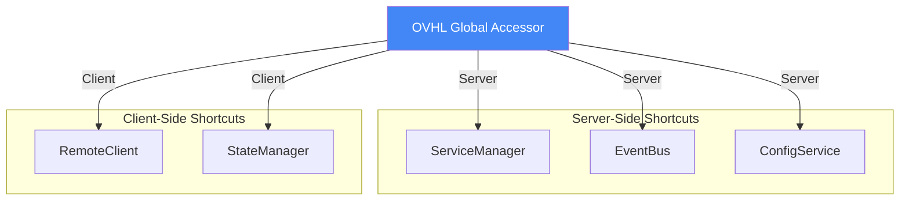
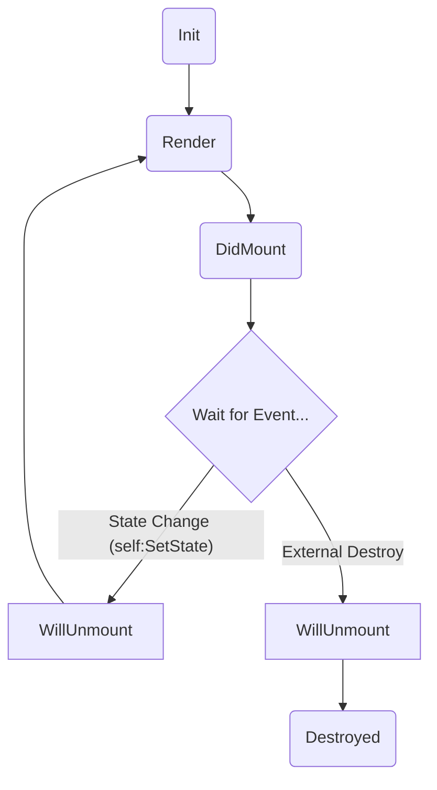

# 📚 OVHL CORE - REFERENSI API

## 📋 INFORMASI DOKUMEN

| Properti            | Nilai                                           |
| ------------------- | ----------------------------------------------- |
| **ID Dokumen**      | `API-001`                                       |
| **Versi Dokumen**   | `1.1.0`                                         |
| **Status**          | `Aktif (Telah Direvisi)`                        |
| **Lokasi Path**     | `./docs/01_CORE_FRAMEWORK/1.4_API_REFERENCE.md` |
| **Repository**      | `https://github.com/ovhlstudio/ovhl-roblox`     |
| **Lisensi**         | `MIT`                                           |
| **Relasi**          | `ARCHITECTURE.md (ARC-001)`                     |
| **Penulis**         | `OVHL Core Team`                                |
| **Dibuat Tanggal**  | `27 Oktober 2025`                               |
| **Update Terakhir** | `28 Oktober 2025`                               |

---

## 🔑 1. GLOBAL ACCESSOR API `OVHL` (API UTAMA)

Ini adalah API utama yang akan digunakan oleh **Module Developer**. Semua API ini diakses melalui modul _global accessor_ `OVHL`.

**Diagram Relasi `OVHL`:**



### 1.1. API Server & Client (Shared)

API ini dapat dipanggil di Server dan Client, namun merujuk ke _service_ yang berbeda.

```lua
-- Mengambil Service (Server) atau Controller (Client)
-- [SERVER] Shortcut untuk ServiceManager:GetService(name)
-- [CLIENT] Shortcut untuk ClientController:GetController(name)
OVHL:GetService(name: string) → table

-- Mengambil Modul (Server) atau Modul UI (Client)
-- [SERVER] Shortcut untuk ModuleLoader:GetModule(name)
-- [CLIENT] Shortcut untuk ClientController:GetModule(name)
OVHL:GetModule(name: string) → table

-- Mengambil Konfigurasi Modul (Default atau Live)
-- [SERVER] Shortcut untuk ConfigService:Get(moduleName)
-- [CLIENT] (Tidak tersedia, Client harus meminta via OVHL:Invoke)
OVHL:GetConfig(moduleName: string) → table
```

### 1.2. API Server-Side (Internal)

API ini **hanya** berjalan di Server dan digunakan untuk komunikasi _internal_ yang aman.

```lua
-- Menerbitkan event internal server
-- Shortcut untuk EventBus:Emit(eventName, ...)
OVHL:Emit(eventName: string, ...) → number

-- Berlangganan event internal server
-- Shortcut untuk EventBus:Subscribe(eventName, callback)
OVHL:Subscribe(eventName: string, callback: function) → function (unsubscribe)
```

### 1.3. API Client-Side (Komunikasi & State)

API ini **hanya** berjalan di Client.

```lua
-- (STATE) Mengatur nilai di StateManager
-- Shortcut untuk StateManager:Set(key, value)
OVHL:SetState(key: string, value: any) → boolean

-- (STATE) Mengambil nilai dari StateManager
-- Shortcut untuk StateManager:Get(key, defaultValue)
OVHL:GetState(key: string, defaultValue: any) → any

-- (STATE) Berlangganan perubahan state
-- Shortcut untuk StateManager:Subscribe(key, callback)
OVHL:Subscribe(key: string, callback: function) → function (unsubscribe)

-- (NETWORK) Mengirim event ke server (tanpa menunggu balasan)
-- Shortcut untuk RemoteClient:Fire(eventName, ...)
OVHL:Fire(eventName: string, ...) → boolean

-- (NETWORK) Memanggil fungsi di server (menunggu balasan)
-- Shortcut untuk RemoteClient:Invoke(eventName, ...)
OVHL:Invoke(eventName: string, ...) → any

-- (NETWORK) Mendengar event yang dikirim dari server
-- Shortcut untuk RemoteClient:Listen(eventName, callback)
OVHL:Listen(eventName: string, callback: function) → RBXScriptConnection
```

<details>
<summary>🇬🇧 English Version</summary>

## 🔑 1. `OVHL` GLOBAL ACCESSOR API (PRIMARY API)

This is the primary API intended for **Module Developers**. All these APIs are accessed through the `OVHL` global accessor module.

**`OVHL` Relationship Diagram:**
_(See Mermaid diagram above)_

### 1.1. Server & Client APIs (Shared)

These APIs can be called on both Server and Client, but they refer to different underlying services.

```lua
-- Get a Service (Server) or Controller (Client)
-- [SERVER] Shortcut for ServiceManager:GetService(name)
-- [CLIENT] Shortcut for ClientController:GetController(name)
OVHL:GetService(name: string) → table

-- Get a Module (Server) or UI Module (Client)
-- [SERVER] Shortcut for ModuleLoader:GetModule(name)
-- [CLIENT] Shortcut for ClientController:GetModule(name)
OVHL:GetModule(name: string) → table

-- Get Module Configuration (Default or Live)
-- [SERVER] Shortcut for ConfigService:Get(moduleName)
-- [CLIENT] (Unavailable, Client must request via OVHL:Invoke)
OVHL:GetConfig(moduleName: string) → table
```

### 1.2. Server-Side APIs (Internal)

These APIs run **only** on the Server and are used for secure _internal_ communication.

```lua
-- Emit an internal server event
-- Shortcut for EventBus:Emit(eventName, ...)
OVHL:Emit(eventName: string, ...) → number

-- Subscribe to an internal server event
-- Shortcut for EventBus:Subscribe(eventName, callback)
OVHL:Subscribe(eventName: string, callback: function) → function (unsubscribe)
```

### 1.3. Client-Side APIs (Communication & State)

These APIs run **only** on the Client.

```lua
-- (STATE) Set a value in the StateManager
-- Shortcut for StateManager:Set(key, value)
OVHL:SetState(key: string, value: any) → boolean

-- (STATE) Get a value from the StateManager
-- Shortcut for StateManager:Get(key, defaultValue)
OVHL:GetState(key: string, defaultValue: any) → any

-- (STATE) Subscribe to state changes
-- Shortcut for StateManager:Subscribe(key, callback)
OVHL:Subscribe(key: string, callback: function) → function (unsubscribe)

-- (NETWORK) Fire an event to the server (no return value)
-- Shortcut for RemoteClient:Fire(eventName, ...)
OVHL:Fire(eventName: string, ...) → boolean

-- (NETWORK) Invoke a function on the server (waits for return value)
-- Shortcut for RemoteClient:Invoke(eventName, ...)
OVHL:Invoke(eventName: string, ...) → any

-- (NETWORK) Listen for events fired from the server
-- Shortcut for RemoteClient:Listen(eventName, callback)
OVHL:Listen(eventName: string, callback: function) → RBXScriptConnection
```

</details>

---

## 🔥 2. AUTO-DISCOVERY API (METADATA)

This is an "API" based on table properties. Developers do not call these functions but define them within their module files to be recognized by the system.

### 2.1. `__manifest` (Required)

A table property that **must** exist in all _Services_, _Controllers_, and _Modules_.

| Key              | Type      | Required? | Description                                                  |
| ---------------- | --------- | --------- | ------------------------------------------------------------ |
| `name`           | `string`  | **Yes**   | Unique module name (must match filename).                    |
| `version`        | `string`  | **Yes**   | SemVer version (e.g., "1.0.0").                              |
| `type`           | `string`  | **Yes**   | Module type: `service`, `controller`, or `module`.           |
| `coreDependency` | `string`  | No        | Minimum Core version needed (e.g., ">=1.1.0").               |
| `dependencies`   | `table`   | No        | List of _string_ names of other required modules.            |
| `priority`       | `number`  | No        | Load order (0-100, 100 executes first. Default: 50).         |
| `autoload`       | `boolean` | No        | Should this module be loaded automatically? (Default: true). |
| `domain`         | `string`  | No        | Module category (e.g., `ui`, `gameplay`, `data`, `system`).  |
| `description`    | `string`  | No        | Brief explanation of the module's function.                  |

### 2.2. `__config` (Optional)

An **optional** table property for defining default settings.

```lua
-- Example in ExampleModule.lua
ExampleModule.__config = {
    startHealth = 100,
    debugMode = true,
    defaultWeapon = "Sword"
}
```

- The table structure is flexible, depending on the module's needs.
- Will be read by `ConfigService` during startup.

<details>
<summary>🇬🇧 English Version</summary>

_(English text mirrors the Indonesian section above, explaining the `__manifest` and `__config` table structures)_

</details>

---

## 🎨 3. UI COMPONENT LIFECYCLE API

These APIs are available to all UI modules (files in `src/client/modules/`) which automatically inherit `BaseComponent` and are managed by `UIEngine`.

**Lifecycle Diagram:**



### Lifecycle Methods

```lua
-- Called 1x when the component is created (constructor)
Component:Init()

-- REQUIRED. Must return 1 Instance (Frame, Button, etc.)
-- Called by UIEngine:Mount()
Component:Render() → Instance

-- Called after Render() completes and the UI is mounted
-- Best place for OVHL:Subscribe() or event :Connect()
Component:DidMount()

-- Called before the component is destroyed
-- MANDATORY to clean up (Disconnect) all connections here
Component:WillUnmount()
```

### State Method

```lua
-- Changes the component's internal state and triggers a Re-Render
-- (Shortcut to UIEngine:Unmount -> UIEngine:Mount)
Component:SetState(newState: table)
```

<details>
<summary>🇬🇧 English Version</summary>

_(English text mirrors the Indonesian section above, explaining the UI Component Lifecycle methods)_

</details>

---

## ⚙️ 4. CORE SERVICES API (ADVANCED / SERVER)

These are the underlying APIs of the Core Services on the Server. **Module Developers are advised to use the `OVHL` accessor**, but Core Developers might need direct access.

### 4.1. ServiceManager

_File: `src/server/services/ServiceManager.lua`_

```lua
-- (Auto-discovery) Finds and loads all services in a folder
ServiceManager:AutoDiscoverServices(servicesFolder: Folder) → boolean

-- (Manual) Registers a new service
ServiceManager:RegisterService(name: string, serviceModule: table) → boolean

-- Gets a registered service instance
ServiceManager:GetService(name: string) → table

-- Gets the count of loaded services
ServiceManager:GetServiceCount() → number
```

### 4.2. Logger

_File: `src/server/services/Logger.lua`_

```lua
-- Basic log with level (INFO, WARN, ERROR)
Logger:Log(level: string, message: string, data: table) → boolean

-- Log shortcuts
Logger:Info(message: string, data: table) → boolean
Logger:Warn(message: string, data: table) → boolean
Logger:Error(message: string, data: table) → boolean
```

### 4.3. EventBus

_File: `src/server/services/EventBus.lua`_

```lua
-- Emits an internal event (server only)
EventBus:Emit(eventName: string, ...) → number

-- Subscribes to an internal event
EventBus:Subscribe(eventName: string, callback: function) → function (unsubscribe)

-- Manually unsubscribes
EventBus:Unsubscribe(eventName: string, callback: function) → boolean
```

### 4.4. ConfigService

_File: `src/server/services/ConfigService.lua`_

```lua
-- (Upgrade) Registers default config from __config
ConfigService:RegisterDefaultConfig(moduleName: string, configTable: table)

-- (Upgrade) Gets config (live or default)
ConfigService:Get(moduleName: string, defaultValue: any) → any

-- (Upgrade) Sets live config (from Admin Panel) and saves it
ConfigService:Set(moduleName: string, value: any) → boolean
```

### 4.5. DataService (Mock)

_File: `src/server/services/DataService.lua`_

```lua
-- Registers a DataStore (currently mock)
DataService:RegisterDataStore(storeName: string, defaultData: table) → boolean

-- Gets player data (currently mock)
DataService:GetPlayerData(player: Player, storeName: string) → boolean, table

-- Saves player data (currently mock)
DataService:SetPlayerData(player: Player, storeName: string, data: table) → boolean
```

### 4.6. RemoteManager

_File: `src/server/services/RemoteManager.lua`_

```lua
-- Registers a handler for OVHL:Invoke or OVHL:Fire
RemoteManager:RegisterHandler(eventName: string, handler: function) → boolean

-- Fires an event to a single client (from server)
RemoteManager:FireClient(player: Player, eventName: string, ...) → boolean

-- Fires an event to all clients (from server)
RemoteManager:FireAllClients(eventName: string, ...) → boolean
```

### 4.7. ModuleLoader

_File: `src/server/services/ModuleLoader.lua`_

```lua
-- (Auto-discovery) Finds and loads all modules in a folder
ModuleLoader:AutoDiscoverModules(modulesFolder: Folder) → boolean

-- Gets a loaded module instance
ModuleLoader:GetModule(name: string) → table
```

<details>
<summary>🇬🇧 English Version</summary>

_(English text mirrors the Indonesian section above, detailing the Core Services APIs)_

</details>

---

## 📱 5. CORE CONTROLLERS API (ADVANCED / CLIENT)

These are the underlying APIs of the Core Controllers on the Client. **Module Developers are advised to use the `OVHL` accessor**.

### 5.1. RemoteClient

_File: `src/client/controllers/RemoteClient.lua`_

```lua
-- Fire an event to the server (no return)
RemoteClient:Fire(eventName: string, ...) → boolean

-- Invoke a function on the server (waits for return)
RemoteClient:Invoke(eventName: string, ...) → any

-- Listen for events from the server
RemoteClient:Listen(eventName: string, callback: function) → RBXScriptConnection

-- Check connection status
RemoteClient:IsConnected() → boolean
```

### 5.2. StateManager

_File: `src/client/controllers/StateManager.lua`_

```lua
-- Set state value
StateManager:Set(key: string, value: any) → boolean

-- Get state value
StateManager:Get(key: string, defaultValue: any) → any

-- Subscribe to state changes
StateManager:Subscribe(key: string, callback: function) → function (unsubscribe)

-- Manually unsubscribe
StateManager:Unsubscribe(key: string, callback: function) → boolean
```

### 5.3. UIEngine

_File: `src/client/controllers/UIEngine.lua`_

```lua
-- Creates a component instance (used by UIController)
UIEngine:CreateComponent(ComponentClass: table, props: table) → table

-- Mounts a component to the UI (used by UIController)
UIEngine:Mount(component: table, parent: Instance) → Instance

-- Unmounts a component (used by UIController)
UIEngine:Unmount(component: table) → boolean
```

### 5.4. UIController

_File: `src/client/controllers/UIController.lua`_

```lua
-- Registers a UI module as a screen
UIController:RegisterScreen(screenName: string, screenComponent: table) → boolean

-- Shows a registered screen
UIController:ShowScreen(screenName: string, props: table) → boolean
```

### 5.5. StyleManager

_File: `src/client/controllers/StyleManager.lua`_

```lua
-- Gets a color from the active theme
StyleManager:GetColor(colorName: string) → Color3
```

<details>
<summary>🇬🇧 English Version</summary>

_(English text mirrors the Indonesian section above, detailing the Core Controllers APIs)_

</details>

---

## 🔄 Riwayat Perubahan (Changelog)

| Versi     | Tanggal         | Penulis            | Perubahan                                                                                                                                                                                                                                                                                                                                                                         |
| --------- | --------------- | ------------------ | --------------------------------------------------------------------------------------------------------------------------------------------------------------------------------------------------------------------------------------------------------------------------------------------------------------------------------------------------------------------------------- |
| **1.1.0** | **28 Okt 2025** | **OVHL Core Team** | **(REVISI BESAR)** <br/> - Menambahkan `Global Accessor OVHL` API (Poin 1). <br/> - Menambahkan `Auto-Discovery API` (`__manifest`, `__config`) (Poin 2). <br/> - Menambahkan `UI Component Lifecycle API` (Poin 3). <br/> - Memindahkan API inti ke Poin 4 & 5 (Advanced). <br/> - Menambahkan format bilingual (ID + EN). <br/> - Memperbarui format metadata dan path dokumen. |
| 1.0.0     | 27 Okt 2025     | OVHL Core Team     | Rilis awal dokumen API.                                                                                                                                                                                                                                                                                                                                                           |

---

<p align="center">
  <small>Hak Cipta © 2025 OVHL Studio. Semua Hak Dilindungi.</small>
</p>
