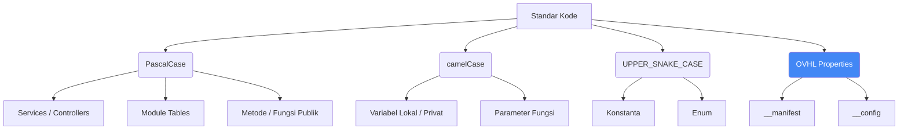

# 📋 OVHL CORE - STANDAR PENGEMBANGAN

## 📋 INFORMASI DOKUMEN

| Properti            | Nilai                                                |
| ------------------- | ---------------------------------------------------- |
| **ID Dokumen**      | `DEV-001`                                            |
| **Versi Dokumen**   | `1.1.2`                                              |
| **Status**          | `Aktif (Telah Direvisi)`                             |
| **Lokasi Path**     | `./docs/02_MODULES_STANDARDS/2.1_MODULE_STANDART.md` |
| **Repository**      | `https://github.com/ovhlstudio/ovhl-roblox`          |
| **Lisensi**         | `MIT`                                                |
| **Relasi**          | `ARCHITECTURE.md (ARC-001)`                          |
| **Penulis**         | `OVHL Core Team`                                     |
| **Dibuat Tanggal**  | `27 Oktober 2025`                                    |
| **Update Terakhir** | `28 Oktober 2025`                                    |

---

## 🏷️ 1. KONVENSI PENAMAAN

Konsistensi adalah kunci. Semua nama file dan variabel harus mengikuti aturan ini.

### 1.1. File & Folder

- **`PascalCase`**: Untuk file _ModuleScript_ yang berisi "Class" atau _Service_ tunggal (Contoh: `ServiceManager.lua`, `ExampleModule.lua`, `BaseComponent.lua`).
- **`camelCase`**: (Jarang) Untuk file _utility_ kecil.
- **`kebab-case`**: (Hindari) Jangan gunakan di nama file Luau.

### 1.2. Penamaan Kode (Luau)

Diagram ini menunjukkan standar penamaan variabel, fungsi, dan _event_ di dalam kode.



**Contoh Kode:**

```lua
-- ✅ BENAR

-- Services / Modules: PascalCase
local ExampleModule = {}
ExampleModule.__index = ExampleModule

-- Properties OVHL: __lowercase
ExampleModule.__manifest = { ... }
ExampleModule.__config = { ... }

-- Metode Publik: PascalCase
function ExampleModule:Init()
    -- Variabel Privat: _camelCase (jika perlu disimpan di self)
    self._privateData = {}
end

function ExampleModule:Start()
    -- Variabel Lokal: camelCase
    local logger = OVHL:GetService("Logger")
    local eventBus = OVHL:GetService("EventBus")

    eventBus:Subscribe("PlayerJoined", function(player) -- Event: PascalCase
        self:HandlePlayerJoined(player) -- Parameter: camelCase
    end)
end

-- Konstanta: UPPER_SNAKE_CASE
local MAX_HEALTH = 100
local DEFAULT_WEAPON = "Sword"

return ExampleModule
```

<details>
<summary>🇬🇧 English Version</summary>

## 🏷️ 1. NAMING CONVENTIONS

Consistency is key. All file and variable names must follow these rules.

### 1.1. Files & Folders

- **`PascalCase`**: For _ModuleScript_ files containing a single "Class" or Service (Example: `ServiceManager.lua`, `ExampleModule.lua`, `BaseComponent.lua`).
- **`camelCase`**: (Rarely) For small utility files.
- **`kebab-case`**: (Avoid) Do not use for Luau file names.

### 1.2. Code Naming (Luau)

This diagram shows the naming standard for variables, functions, and events within the code.
_(See Mermaid diagram above)_

**Code Example:**
_(See Lua code block above)_

</details>

---

## 🏗️ 2. CODE STRUCTURE STANDARDS

### 2.1. File Organization

The `src/` folder structure is fixed and should not be changed. The view in VS Code should look like this:

```text
src/
├── server/
│   ├── services/       (Core Services)
│   ├── modules/        (Game Modules)
│   └── init.server.lua (Bootstrap)
│
├── client/
│   ├── controllers/    (Core Controllers)
│   ├── modules/        (UI Modules)
│   ├── lib/            (Client Libs)
│   └── init.client.lua (Bootstrap)
│
└── shared/
    ├── utils/          (Core Utils - Manifest, Resolver)
    ├── OVHL_Global.lua   (Global Accessor)
    └── constants/      (Shared Constants)
```

### 2.2. Server Module Template (Service Example)

All new _Services_ **MUST** follow this template, complete with `__manifest` and `__config`.

```lua
-- File: src/server/services/MyNewService.lua
-- Get the global accessor (if needed in Init/Start)
local OVHL = require(game.ReplicatedStorage.OVHL_Shared.OVHL_Global)

local MyNewService = {}
MyNewService.__index = MyNewService

-- 🔥 MANIFEST (REQUIRED)
MyNewService.__manifest = {
    name = "MyNewService",
    version = "1.0.0",
    type = "service",
    coreDependency = ">=1.1.0",
    dependencies = {"Logger", "EventBus"}, -- Example dependencies
    priority = 80,
    domain = "system",
    description = "Brief description of this service"
}

-- ⚙️ DEFAULT CONFIGURATION (OPTIONAL)
MyNewService.__config = {
    someSetting = true,
    retryAttempts = 3
}

-- 1. Initialization (Called first, before Start)
function MyNewService:Init()
    self.logger = OVHL:GetService("Logger") -- Safe to call GetService in Init
    self.config = OVHL:GetConfig("MyNewService")

    self.data = {}
    self.logger:Info("MyNewService Initialized")
    return true
end

-- 2. Startup (Called after ALL services have been Init-ed)
function MyNewService:Start()
    local eventBus = OVHL:GetService("EventBus")

    -- Setup event listeners
    eventBus:Subscribe("SomeEvent", function(...)
        self:HandleSomeEvent(...)
    end)

    self.logger:Info("MyNewService Started")
    return true
end

-- 3. Public Methods
function MyNewService:HandleSomeEvent(param1, param2)
    -- Always wrap risky logic in pcall
    local success, result = pcall(function()
        -- ... Business logic here ...
        if self.config.someSetting then
            return "Success"
        end
    end)

    if not success then
        self.logger:Error("HandleSomeEvent failed", {error = result})
        return false, result
    end

    return true, result
end

return MyNewService
```

<details>
<summary>🇬🇧 English Version</summary>

_(English text mirrors the Indonesian section above, explaining File Organization and the Server Module Template)_

</details>

---

## 🎨 3. CODE STYLE GUIDELINES

- **Indentation:** Use **4 spaces**. Do not use _tabs_.
- **Spacing:** Use spaces around operators (`a = b + c`, not `a=b+c`).
- **Comments:** Write clear comments for public functions and complex logic blocks.
- **`require`:** Place all `require` statements at the top of the file.
- **`self`:** Always use `self` for object-oriented methods (`function MyModule:Start()`). Use `.` for static utility functions (`function MyModule.Utils()`).

<details>
<summary>🇬🇧 English Version</summary>

_(English text mirrors the Indonesian section above, outlining code style guidelines)_

</details>

---

## ⚠️ 4. ERROR HANDLING STANDARDS ("NO CRASH")

OVHL's philosophy is **Graceful Degradation**. The game must not _crash_.

### 4.1. `pcall` is Mandatory

All potentially risky operations **MUST** be wrapped in `pcall`. This includes:

- Network calls (`OVHL:Invoke`).
- DataStore operations (`DataService`).
- Complex business logic within event handlers.
- Logic within `Module:Start()` (this is already handled automatically by `ModuleLoader`).

### 4.2. `pcall` and Logging Pattern

Always log errors with detailed context using `Logger`.

```lua
-- ✅ CORRECT ERROR HANDLING PATTERN

local success, result = pcall(function()
    -- Risky operation (e.g., calling external API or complex logic)
    return riskyOperation(data)
end)

if not success then
    -- Log error with full context
    local logger = OVHL:GetService("Logger")
    logger:Error("Operation Failed: riskyOperation", {
        operation = "riskyOperation",
        error = result, -- 'result' contains the error message
        data = data
    })

    -- Return error or a default fallback value
    return false, result
end

-- 'result' contains the successful outcome
return true, result
```

<details>
<summary>🇬🇧 English Version</summary>

_(English text mirrors the Indonesian section above, explaining the "No Crash" philosophy and the `pcall` pattern)_

</details>

---

## 🔄 5. GIT WORKFLOW

Follow _Conventional Commits_ standards for a clear history.

### 5.1. Branching Pattern

- `main`: Stable production code.
- `develop`: Main development branch.
- `feature/<description>`: New features (e.g., `feature/inventory-system`).
- `fix/<description>`: Bug fixes (e.g., `fix/data-race-bug`).
- `docs/<description>`: Documentation changes (e.g., `docs/update-api-ref`).

### 5.2. Commit Message Format

**Format:** `type(scope): description`

- **`type`**: `feat` (new feature), `fix`, `docs`, `style` (formatting), `refactor`, `test`, `chore` (maintenance).
- **`scope`** (optional): Area of code changed (e.g., `auth`, `ui`, `servicemanager`).

**Examples:**

- `feat(network): add RemoteManager v5`
- `fix(ui): correct HUD rendering bug`
- `docs(api): update API_REFERENCE with OVHL Accessor`

<details>
<summary>🇬🇧 English Version</summary>

_(English text mirrors the Indonesian section above, outlining the Git workflow standards)_

</details>

---

## 🧪 6. TESTING STANDARDS

- All _Core Services_ should have a test suite (using TestEZ or a similar framework).
- Bug fixes should include new test cases to prevent regressions.
- Use `TestDashboard.lua` for runtime debugging within the game.

<details>
<summary>🇬🇧 English Version</summary>

_(English text mirrors the Indonesian section above, outlining testing standards)_

</details>

---

## 🔧 7. TOOLING

- **Rojo:** Used for syncing files from VS Code to Roblox Studio.
- **VS Code:** Primary code editor.
- **Selene:** Linter to maintain Luau code quality.
- **Git:** Mandatory for version control.

<details>
<summary>🇬🇧 English Version</summary>

_(English text mirrors the Indonesian section above, listing the required tooling)_

</details>

---

## 🔄 Riwayat Perubahan (Changelog)

| Versi     | Tanggal         | Penulis            | Perubahan                                                                                                                                                                                                                                                                                                                                                                                  |
| --------- | --------------- | ------------------ | ------------------------------------------------------------------------------------------------------------------------------------------------------------------------------------------------------------------------------------------------------------------------------------------------------------------------------------------------------------------------------------------ |
| **1.1.2** | **28 Okt 2025** | **OVHL Core Team** | - **[FIX]** Mengganti diagram Mermaid 'Organisasi File' (Poin 2.1) dengan _text tree_ agar tidak error.                                                                                                                                                                                                                                                                                    |
| 1.1.1     | 28 Okt 2025     | OVHL Core Team     | - **[FIX]** Memperbaiki diagram Mermaid 'Organisasi File' (Poin 2.1) agar tidak error.                                                                                                                                                                                                                                                                                                     |
| 1.1.0     | 28 Okt 2025     | OVHL Core Team     | **(REVISI BESAR)** <br/> - Memperbarui _path_ dokumen ke struktur baru. <br/> - Menambahkan standar `__manifest` dan `__config` (Poin 1.2). <br/> - Meng-update _Template Modul Server_ (Poin 2.2) untuk menggunakan `OVHL`, `__manifest`, `__config`. <br/> - Memperkuat standar `Error Handling` (Poin 4) agar sesuai `ARCHITECTURE.md`. <br/> - Menambahkan format bilingual (ID + EN). |
| 1.0.0     | 27 Okt 2025     | OVHL Core Team     | Rilis awal dokumen standar.                                                                                                                                                                                                                                                                                                                                                                |

---

<p align="center">
  <small>Hak Cipta © 2025 OVHL Studio. Semua Hak Dilindungi.</small>
</p>
