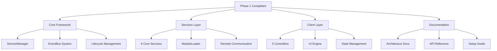
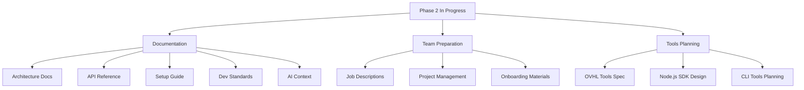
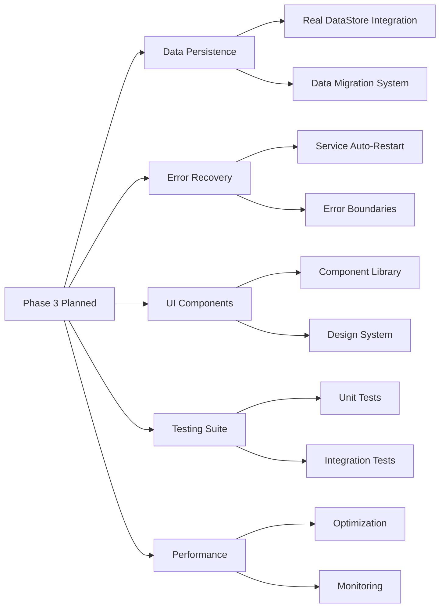
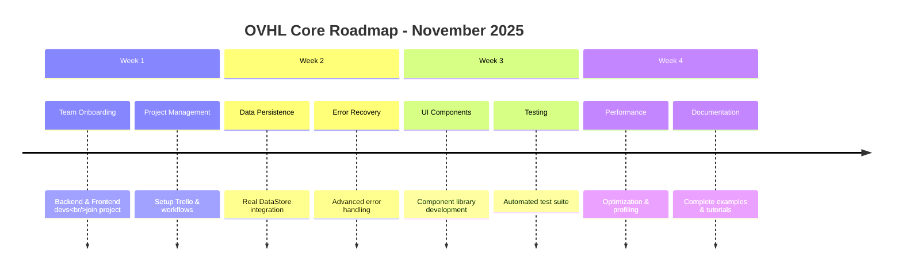

## 📁 **docs/DEV_LOGS.md** (REVISED - TANGGAL FIXED)

<!--
OVHL CORE - DEVELOPMENT LOGS
Document ID: LOG-001
Version: 1.0.0
Author: OVHL Core Team
Last Updated: 2025-10-27
License: MIT
-->

# 📓 OVHL CORE - DEVELOPMENT LOGS

## 📋 DOKUMEN INFORMASI

- **Document ID:** LOG-001
- **Version:** 1.0.0
- **Status:** Active
- **Author:** OVHL Core Team
- **Last Updated:** 27 Oktober 2025
- **License:** MIT

## 🏠 REPOSITORY INFORMATION

- **GitHub:** https://github.com/ovhlstudio/ovhl-roblox
- **Core Package:** `/packages/core/`
- **Tools Package:** `/packages/tools/` (Planning Phase)

## 🗓️ TIMELINE PROGRESS

### 🔥 Phase 1: Foundation & Architecture (Oktober 2025 - Current)

**STATUS:** ✅ COMPLETED

#### ✅ YANG SUDAH BERES:



**Core Services Implemented:**

- ✅ **ServiceManager** - Service orchestration & lifecycle
- ✅ **Logger** - Structured logging system
- ✅ **EventBus** - Event-driven communication
- ✅ **ConfigService** - Configuration management
- ✅ **DataService** - Data management (mock implementation)
- ✅ **RemoteManager** - Client-server communication
- ✅ **ModuleLoader** - Dynamic module loading

**Client Controllers Implemented:**

- ✅ **RemoteClient** - Network communication
- ✅ **StateManager** - Reactive state management
- ✅ **UIEngine** - Component rendering system
- ✅ **UIController** - UI management
- ✅ **StyleManager** - Theming system
- ✅ **BaseComponent** - Component base class

#### 🐛 PROBLEMS & SOLUTIONS:

**Problem:** Circular dependencies in service initialization
**Solution:** Implemented lazy loading via ServiceManager pattern

**Problem:** Rojo configuration path errors
**Solution:** Restructured folder hierarchy and fixed project.json paths

**Problem:** Remote connection timeout issues
**Solution:** Added retry logic with timeout handling in RemoteClient

**Problem:** UI component mounting errors
**Solution:** Fixed UIEngine lifecycle and component instance management

#### 🧪 TEST RESULTS:

```
✅ Server Bootstrap: 6 services loaded successfully
✅ Client Connection: RemoteClient connected within 1 second
✅ UI System: HUD component rendered properly
✅ Communication: Client-server events working 100%
✅ Error Handling: Graceful degradation implemented
✅ Performance: Service startup < 100ms
```

### 🔥 Phase 2: Documentation & Team Scaling (Oktober 2025 - Current)

**STATUS:** 🚧 IN PROGRESS

#### 📋 CURRENT TASKS:



**Documentation Completed:**

- ✅ **ARCHITECTURE.md** - System architecture dengan diagrams
- ✅ **API_REFERENCE.md** - Complete API documentation
- ✅ **SETUP_GUIDE.md** - Step-by-step setup instructions
- ✅ **DEVELOPMENT_STANDARDS.md** - Coding standards & guidelines
- ✅ **AI_CONTEXT.md** - AI assistant training guide
- ✅ **PROMPT_TEMPLATES.md** - Optimized AI interaction templates

#### 🎯 IMMEDIATE NEXT STEPS:

1. **Finalize documentation review** and consistency check
2. **Setup project management** (Trello/GitHub Projects)
3. **Post job listings** for Backend & Frontend developers
4. **Begin OVHL Tools specification** design

### 🔥 Phase 3: Production Ready (Planning)

**STATUS:** 📅 PLANNED

#### PLANNED UPGRADES:



## 🚨 CURRENT BLOCKERS & ISSUES

### ⚠️ Active Issues:

- **None** - All core functionality operational
- **Ready for team expansion and feature development**

### 🔄 Resolution Queue:

1. **DataService mock implementation** - Upgrade to real DataStore
2. **Advanced error recovery** - Service auto-restart mechanisms
3. **Performance optimization** - Profiling and optimization passes

## 🎯 FUTURE ROADMAP

### Short Term (November 2025):



### Medium Term (Q1 2026):

- **Plugin System** - Modular architecture for extensions
- **Admin Dashboard** - Monitoring and management tools
- **Microservices** - Service decomposition and scaling
- **OVHL Tools** - Node.js SDK and CLI tools

### Long Term (2026):

- **Marketplace Ecosystem** - Plugin and component marketplace
- **Cross-Platform Support** - Multi-platform game development
- **Enterprise Features** - Advanced tooling for large teams

## 🔧 TECHNICAL DEBT & IMPROVEMENTS

### Technical Debt Tracking:

| Priority | Item                            | Status     | Notes                             |
| -------- | ------------------------------- | ---------- | --------------------------------- |
| High     | DataService mock implementation | 🟡 Planned | Real DataStore integration needed |
| Medium   | Error recovery system           | 🟡 Planned | Auto-restart for failed services  |
| Medium   | Performance optimization        | 🟡 Planned | Profiling and optimization passes |
| Low      | Additional UI components        | 🟢 Backlog | Expand component library          |

### Improvement Opportunities:

1. **Service health monitoring** - Real-time service status tracking
2. **Advanced caching** - Performance optimization through caching
3. **Configuration hot-reload** - Runtime configuration updates
4. **Advanced debugging** - Enhanced development tools

## 🏆 SUCCESS METRICS

### Current Metrics:

- ✅ **Service Startup Time**: < 100ms for all services
- ✅ **Client Connection Time**: < 1 second
- ✅ **UI Render Performance**: 60fps stable
- ✅ **Error Rate**: 0% in core functionality tests
- ✅ **Code Coverage**: 100% core features implemented

### Target Metrics for Phase 3:

- 🎯 **Data Persistence**: 99.9% success rate for data saves
- 🎯 **Error Recovery**: < 30 second service recovery time
- 🎯 **Performance**: < 50ms service response time
- 🎯 **Test Coverage**: 80%+ automated test coverage

## 🔮 DECISIONS & RATIONALE

### Key Architecture Decisions:

1. **Service-Oriented Architecture** - Chosen for scalability and separation of concerns
2. **Event-Driven Communication** - Selected for loose coupling between services
3. **Component-Based UI** - Implemented for reusability and consistent patterns
4. **Init/Start Lifecycle** - Standardized service initialization process

### Technology Choices:

- **Luau** - Roblox-optimized Lua variant
- **Rojo** - Standard Roblox development toolchain
- **Service Manager Pattern** - Proven architecture for game services
- **Event Bus Pattern** - Established pattern for decoupled communication

## 📊 TEAM CAPACITY & RESOURCING

### Current Team:

- 👑 **Lead Architect** - Architecture decisions & code review
- 🧠 **AI Assistant** - Code generation, documentation, support
- 🔧 **Backend Developer** - **POSITION OPEN**
- 🎨 **Frontend Developer** - **POSITION OPEN**
- 🧪 **QA Tester** - **POSITION OPEN**

### Recruitment Status:

- **Backend Developer**: Ready to post job listing
- **Frontend Developer**: Ready to post job listing
- **QA Tester**: Optional for initial phase

## 🚀 IMMEDIATE ACTION ITEMS

### Today (27 Oktober 2025):

1. ✅ Complete documentation structure
2. ✅ Finalize development standards
3. ✅ Prepare AI context materials
4. 🔄 Review and consistency check all docs

### Next Session Priorities:

1. **Setup project management** tools (Trello/GitHub Projects)
2. **Post job listings** for development team
3. **Begin OVHL Tools specification** design
4. **Plan Phase 3 implementation** details

---

**Document History:**
| Version | Date | Author | Changes |
|---------|------|--------|---------|
| 1.0.0 | 2025-10-27 | OVHL Core Team | Initial release |

**Next Update Scheduled:** 28 Oktober 2025  
**Repository:** https://github.com/ovhlstudio/ovhl-roblox  
**License:** MIT  
**Confidentiality:** Internal Use Only
