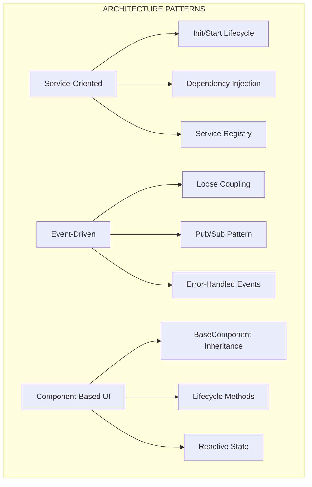
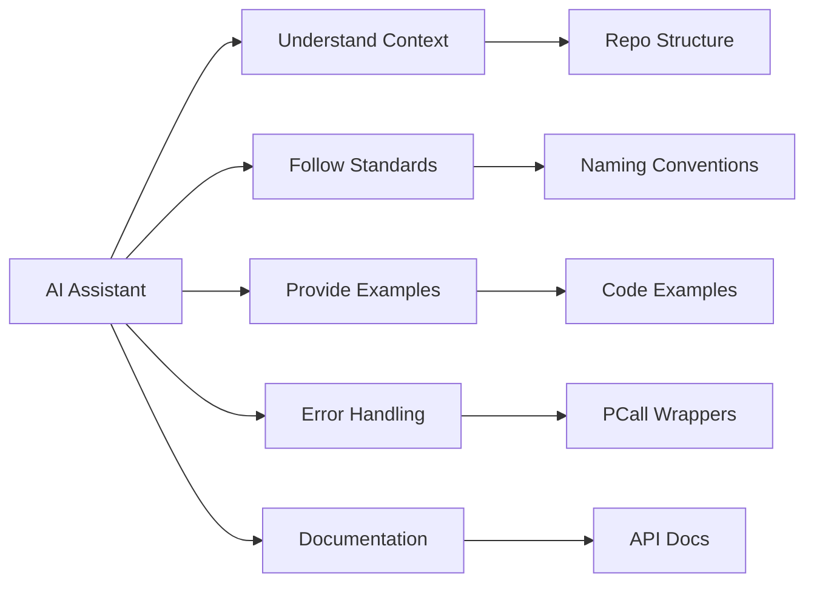

## 📁 **docs/ai_context/OVHL_AI_CONTEXT.md**

<!--
OVHL CORE - AI CONTEXT & TRAINING GUIDE
Document ID: AI-001
Version: 1.0.0
Author: OVHL Core Team
Last Updated: 2025-10-27
License: MIT
-->

# 🧠 OVHL CORE - AI CONTEXT & TRAINING GUIDE

## 📋 DOKUMEN INFORMASI

- **Document ID:** AI-001
- **Version:** 1.0.0
- **Status:** Active
- **Author:** OVHL Core Team
- **Last Updated:** 27 Oktober 2025
- **License:** MIT

## 🏠 REPOSITORY INFORMATION

- **GitHub:** https://github.com/ovhlstudio/ovhl-roblox
- **Core Package:** `/packages/core/`
- **Language:** Luau (Roblox)
- **Architecture:** Service-Oriented + Event-Driven

## 🎯 PURPOSE

This document provides comprehensive context for AI assistants working on OVHL Core project. Contains project-specific knowledge, patterns, and guidelines for effective collaboration.

## 📚 PROJECT KNOWLEDGE BASE

### Core Architecture Patterns



### Key Design Principles

1. **Separation of Concerns** - Each service has single responsibility
2. **Loose Coupling** - Services communicate via EventBus, not direct calls
3. **Error Resilience** - Graceful degradation and comprehensive error handling
4. **Performance First** - Optimized for Roblox environment constraints

## 🔧 DEVELOPMENT WORKFLOW

### File Structure Rules

```
packages/core/src/
├── server/
│   ├── services/    # Business logic services
│   ├── modules/     # Game feature modules
│   └── lib/         # Server utilities
├── client/
│   ├── controllers/ # UI logic controllers
│   ├── modules/     # UI components
│   └── lib/         # Client utilities
└── shared/          # Cross-platform code
```

### Naming Conventions

- **Services:** PascalCase (ServiceManager, DataService)
- **Methods:** PascalCase (Init, Start, RegisterService)
- **Events:** PascalCase with category (PlayerJoined, GameStateChanged)
- **Variables:** camelCase (playerData, serviceInstance)
- **Constants:** UPPER_SNAKE_CASE (MAX_PLAYERS, DEFAULT_COINS)

## 🎓 TRAINING EXAMPLES

### Example 1: Creating a New Service

```lua
-- File: packages/core/src/server/services/InventoryService.lua
local InventoryService = {}
InventoryService.__index = InventoryService

function InventoryService:Init()
    self.items = {}
    self.initialized = true
    return true
end

function InventoryService:Start()
    -- Register event handlers via EventBus
    local EventBus = ServiceManager:GetService("EventBus")
    EventBus:Subscribe("PlayerJoined", function(player)
        self:LoadPlayerInventory(player)
    end)
    return true
end

function InventoryService:LoadPlayerInventory(player)
    local DataService = ServiceManager:GetService("DataService")
    local success, inventory = DataService:GetPlayerData(player, "Inventory")

    if success then
        self.items[player.UserId] = inventory
        Logger:Info("Inventory loaded", {player = player.Name})
    else
        Logger:Error("Failed to load inventory", {player = player.Name, error = inventory})
    end
end

-- Registration in ModuleLoader or init.server.lua
ServiceManager:RegisterService("InventoryService", InventoryService)
```

### Example 2: Client-Server Communication

```lua
-- Server: packages/core/src/server/services/EconomyService.lua
RemoteManager:RegisterHandler("PurchaseItem", function(player, itemId)
    local EconomyService = ServiceManager:GetService("EconomyService")
    local success, result = EconomyService:PurchaseItem(player, itemId)

    if success then
        return {
            success = true,
            newBalance = result.balance,
            item = result.item
        }
    else
        return {
            success = false,
            error = result
        }
    end
end)

-- Client: packages/core/src/client/modules/ShopUI.lua
local result = RemoteClient:Invoke("PurchaseItem", "sword_001")

if result.success then
    StateManager:Set("coins", result.newBalance)
    StateManager:Set("inventory", result.item)
else
    Logger:Warn("Purchase failed", {error = result.error})
end
```

### Example 3: UI Component with State

```lua
-- File: packages/core/src/client/modules/ShopUI.lua
local BaseComponent = require("packages.core.src.client.lib.BaseComponent")

local ShopUI = setmetatable({}, BaseComponent)
ShopUI.__index = ShopUI

function ShopUI:Init()
    BaseComponent.Init(self)
    self.state = {
        items = {},
        selectedItem = nil,
        balance = 0
    }
end

function ShopUI:DidMount()
    -- Setup state subscriptions
    self._unsubscribeBalance = StateManager:Subscribe("coins", function(value)
        self:SetState({balance = value or 0})
    end)

    -- Load initial data
    self:LoadShopItems()
end

function ShopUI:WillUnmount()
    -- Cleanup subscriptions
    if self._unsubscribeBalance then
        self._unsubscribeBalance()
    end
end

function ShopUI:Render()
    local StyleManager = require("packages.core.src.client.controllers.StyleManager")

    return self:CreateFrame({
        Size = UDim2.new(1, 0, 1, 0),
        BackgroundColor3 = StyleManager:GetColor("background")
    }, {
        -- UI rendering logic
        self:CreateTextLabel({
            Text = "Balance: " .. self.state.balance,
            TextColor3 = StyleManager:GetColor("text")
        })
    })
end

return ShopUI
```

## 🚨 COMMON PITFALLS & SOLUTIONS

### Pitfall 1: Circular Dependencies

```lua
-- ❌ WRONG: ServiceA requires ServiceB which requires ServiceA
function ServiceA:SomeMethod()
    local serviceB = ServiceB -- Direct access causes circular dependency
end

-- ✅ SOLUTION: Use ServiceManager or EventBus
function ServiceA:SomeMethod()
    local serviceB = ServiceManager:GetService("ServiceB") -- Lazy loading
    -- OR
    EventBus:Emit("NeedServiceB", data) -- Event-driven
end
```

### Pitfall 2: Missing Error Handling

```lua
-- ❌ WRONG: No error handling
service:CriticalOperation()

-- ✅ CORRECT: Proper error handling with logging
local success, err = pcall(service.CriticalOperation, service)
if not success then
    Logger:Error("Critical operation failed", {
        service = "ServiceName",
        operation = "CriticalOperation",
        error = err
    })
    -- Implement fallback or recovery
    return fallbackStrategy()
end
```

### Pitfall 3: Direct Service Access

```lua
-- ❌ WRONG: Bypassing ServiceManager
local service = SomeService -- Global access

-- ✅ CORRECT: Through ServiceManager
local service = ServiceManager:GetService("SomeService")
```

## 🔍 DEBUGGING & TROUBLESHOOTING

### Common Error Patterns:

1. **"service is not a valid member"** → Check Rojo config paths in `packages/core/default.project.json`
2. **Remote connection timeout** → Verify RemoteManager initialization order in `init.server.lua`
3. **UI not rendering** → Check UIController startup sequence in `init.client.lua`
4. **Event not firing** → Verify EventBus subscription timing

### Debug Template:

```lua
Logger:Info("DebugPoint", {
    component = "ServiceName",
    state = self.state,
    data = debugData,
    timestamp = os.time()
})
```

## 📖 CONTINUOUS LEARNING

### When Adding New Features:

1. **Check existing patterns** in similar services
2. **Follow naming conventions** from DEVELOPMENT_STANDARDS.md
3. **Implement proper error handling** with comprehensive logging
4. **Add documentation** for new APIs
5. **Update relevant documentation** if patterns change

### When Fixing Bugs:

1. **Reproduce the issue** with minimal test case
2. **Check service logs** for error context
3. **Verify event flow** and data transformations
4. **Test fix thoroughly** with edge cases
5. **Update documentation** if API behavior changes

## 🎯 AI ASSISTANT GUIDELINES

### Response Patterns:



### Quality Checklist:

- [ ] Follow OVHL architecture patterns
- [ ] Use proper error handling with pcall()
- [ ] Include comprehensive logging
- [ ] Follow naming conventions
- [ ] Provide usage examples
- [ ] Update relevant documentation
- [ ] Consider performance implications

### Effective Prompting:

```
CONTEXT: OVHL Core Project - [Feature/Bug]
OBJECTIVE: [Clear description]
CONSTRAINTS:
- Follow OVHL architecture patterns
- Use existing services when possible
- Implement proper error handling
- Add comprehensive logging
- Follow naming conventions

SPECIFIC REQUIREMENTS:
1. [Requirement 1]
2. [Requirement 2]

OUTPUT FORMAT:
- Complete Luau code with OVHL patterns
- Documentation comments
- Usage examples
- Error handling implementation
```

## 🔄 KNOWLEDGE UPDATES

### Recent Changes (v1.0.0):

- ✅ Service-oriented architecture established
- ✅ 6 core services implemented
- ✅ 5 client controllers operational
- ✅ Event-driven communication working
- ✅ Component-based UI system functional

### Known Limitations:

- DataService currently uses mock data (real DataStore integration pending)
- Error recovery system in development
- Advanced state management features planned
- Plugin system architecture upcoming

---

**Document History:**
| Version | Date | Author | Changes |
|---------|------|--------|---------|
| 1.0.0 | 2025-10-27 | OVHL Core Team | Initial release |

**Repository:** https://github.com/ovhlstudio/ovhl-roblox  
**License:** MIT  
**Confidentiality:** Internal Use Only
