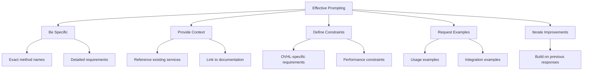

## 📁 **docs/ai_context/PROMPT_TEMPLATES.md**

<!--
OVHL CORE - AI PROMPT TEMPLATES
Document ID: AI-002
Version: 1.0.0
Author: OVHL Core Team
Last Updated: 2025-10-27
License: MIT
-->

# 💬 OVHL CORE - AI PROMPT TEMPLATES

## 📋 DOKUMEN INFORMASI

- **Document ID:** AI-002
- **Version:** 1.0.0
- **Status:** Active
- **Author:** OVHL Core Team
- **Last Updated:** 27 Oktober 2025

## 🏠 REPOSITORY INFORMATION

- **GitHub:** https://github.com/ovhlstudio/ovhl-roblox
- **Core Package:** `/./`
- **Context File:** `docs/ai_context/OVHL_AI_CONTEXT.md`

## 🎯 EFFECTIVE PROMPT STRUCTURE

### Template 1: Feature Development

```markdown
CONTEXT: OVHL Core Project - [Feature Name]
REPOSITORY: https://github.com/ovhlstudio/ovhl-roblox
LOCATION: ./src/

OBJECTIVE: [Clear description of what to build]

ARCHITECTURE CONSTRAINTS:

- Follow OVHL service-oriented architecture
- Use ServiceManager for service registration
- Implement Init()/Start() lifecycle methods
- Communicate via EventBus for loose coupling
- Extend BaseComponent for UI components

ERROR HANDLING REQUIREMENTS:

- All risky operations wrapped in pcall()
- Comprehensive error logging with Logger service
- Graceful degradation strategies
- Return boolean + data pattern from methods

SPECIFIC REQUIREMENTS:

1. [Requirement 1 with detailed acceptance criteria]
2. [Requirement 2 with detailed acceptance criteria]
3. [Integration points with existing services]

OUTPUT FORMAT:

- Complete Luau code following OVHL patterns
- File paths relative to ./src/
- Documentation comments for all public methods
- Usage examples with error handling
- Integration examples with existing services
```

### Template 2: Bug Fixing

```markdown
CONTEXT: OVHL Core Project - Bug Report
REPOSITORY: https://github.com/ovhlstudio/ovhl-roblox

ISSUE: [Describe the bug in detail]
CURRENT BEHAVIOR: [What happens now - include error messages]
EXPECTED BEHAVIOR: [What should happen]

DEBUGGING INFO:

- Error messages: [Paste exact error text]
- Relevant services: [List services involved]
- Reproduction steps: [Step-by-step how to reproduce]
- Environment: [Server/Client, specific conditions]

ROOT CAUSE ANALYSIS REQUEST:

- Identify the underlying cause
- Explain why it's happening
- Suggest preventive measures

FIX REQUIREMENTS:

- Maintain backward compatibility
- Follow OVHL error handling standards
- Add comprehensive logging
- Include regression tests if possible

OUTPUT:

- Root cause explanation
- Complete fix implementation
- Testing instructions
- Prevention recommendations
```

### Template 3: Code Review

```markdown
CONTEXT: OVHL Core Code Review
REPOSITORY: https://github.com/ovhlstudio/ovhl-roblox

CODE TO REVIEW: [Paste code snippet or describe location]

REVIEW CRITERIA:

- OVHL architecture compliance
- Service lifecycle implementation
- Error handling adequacy
- Performance considerations
- Code readability and maintainability
- Documentation quality
- Naming convention adherence

SPECIFIC CONCERNS:

- [Any particular areas of concern]

REQUEST:

- Identify architecture violations
- Suggest specific improvements
- Provide corrected code examples
- Recommend best practice alternatives
- Highlight potential performance issues
```

## 🔧 SPECIFIC TASK TEMPLATES

### Service Creation Template

```markdown
TASK: Create new OVHL service
CONTEXT: OVHL Core Architecture

SERVICE SPECIFICATION:

- SERVICE NAME: [Name in PascalCase]
- PURPOSE: [Clear one-sentence purpose]
- LOCATION: ./src/server/services/[Name].lua

DEPENDENCIES:

- [List services this depends on]
- [List events this will emit]
- [List events this will listen to]

MAIN METHODS:

- [Method 1]: [Purpose and parameters]
- [Method 2]: [Purpose and parameters]
- [Method 3]: [Purpose and parameters]

INTEGRATION REQUIREMENTS:

- Register with ServiceManager in Init()
- Setup event listeners in Start()
- Follow error handling standards
- Include comprehensive logging

OUTPUT:

- Complete service implementation
- Registration code example
- Usage examples
- Error handling implementation
```

### UI Component Template

```markdown
TASK: Create UI component
CONTEXT: OVHL Core Client Architecture

COMPONENT SPECIFICATION:

- COMPONENT NAME: [Name in PascalCase]
- PURPOSE: [UI element purpose]
- LOCATION: ./src/client/modules/[Name].lua

PROPS INTERFACE:

- [prop1]: [type] - [description]
- [prop2]: [type] - [description]

STATE MANAGEMENT:

- [state1]: [type] - [purpose]
- [state2]: [type] - [purpose]

FEATURES:

- [Feature 1 with behavior details]
- [Feature 2 with behavior details]
- [Event handling requirements]

STYLING REQUIREMENTS:

- Use StyleManager for theming
- Support dark/light mode
- Responsive design considerations

OUTPUT:

- Complete component extending BaseComponent
- Render() method implementation
- Lifecycle methods as needed
- Usage example with props
```

### API Extension Template

```markdown
TASK: Extend existing service API
CONTEXT: OVHL Core - [Service Name]

SERVICE: [Existing service name]
CURRENT VERSION: [Current API version]

NEW METHODS:

- [Method signature]: [Detailed purpose]
- [Method signature]: [Detailed purpose]

BACKWARD COMPATIBILITY:

- [Changes that maintain compatibility]
- [Changes that might break compatibility]

INTEGRATION POINTS:

- Events to emit: [List with descriptions]
- Events to listen: [List with descriptions]
- Data storage: [Where data will be stored]

ERROR HANDLING:

- [Specific error scenarios to handle]
- [Recovery strategies]

OUTPUT:

- Complete method implementations
- Updated service registration if needed
- Usage examples
- Migration guide if breaking changes
```

## 🎓 LEARNING & UNDERSTANDING PROMPTS

### Architecture Understanding

```markdown
TASK: Explain OVHL Core architecture pattern
CONTEXT: OVHL Core Documentation

SPECIFIC ASPECT: [e.g., service communication, UI rendering, data flow]

REQUEST:

- Describe the pattern and its benefits in OVHL context
- Provide concrete code examples from ./src/
- Explain common implementation pitfalls and solutions
- Suggest best practices for the pattern
- Compare with alternative approaches considered

FOCUS: Practical implementation within OVHL constraints
```

### Pattern Implementation

```markdown
TASK: Implement design pattern in OVHL Core
CONTEXT: OVHL Core Architecture

PATTERN: [Pattern name - e.g., Observer, Factory, Singleton]
USE CASE: [Specific scenario in OVHL context]

CONSTRAINTS:

- Must work within OVHL service architecture
- Follow existing naming conventions
- Maintain performance standards
- Integrate with existing error handling

REQUEST:

- Implementation code following OVHL patterns
- Integration examples with existing services
- Potential issues and solutions
- Performance considerations
```

## 📊 PROMPT ENHANCEMENT TIPS

### For Better Results:



### Example Enhancement:

```markdown
❌ BASIC PROMPT:
"Create a login system"

✅ ENHANCED PROMPT:
CONTEXT: OVHL Core Project - Authentication System
REPOSITORY: https://github.com/ovhlstudio/ovhl-roblox

OBJECTIVE: Create AuthenticationService for player login/logout

ARCHITECTURE:

- Location: ./src/server/services/AuthenticationService.lua
- Extend existing ServiceManager/EventBus patterns
- Integrate with DataService for player data
- Use EventBus for login/logout events

METHODS REQUIRED:

- Login(player, credentials): Validate and create session
- Logout(player): End session and cleanup
- ValidateSession(player): Verify active session
- GetPlayerSession(player): Retrieve session data

ERROR HANDLING:

- Invalid credentials handling
- Session expiration
- Network failure recovery
- Data corruption fallbacks

INTEGRATION:

- Emit events: PlayerLoggedIn, PlayerLoggedOut
- Listen to events: PlayerJoined, PlayerLeft
- Store sessions in DataService with "Sessions" store

OUTPUT: Complete service with usage examples and error handling
```

## 🚀 QUICK REFERENCE TEMPLATES

### Quick Service Template

```markdown
Service: [Name]
Location: ./src/server/services/[Name].lua
Dependencies: [Service1, Service2]
Events: Emit [Event1], Listen [Event2]
Methods: [Method1], [Method2]
```

### Quick Component Template

```markdown
Component: [Name]  
Location: ./src/client/modules/[Name].lua
Extends: BaseComponent
Props: [prop1], [prop2]
State: [state1], [state2]
Features: [feature1], [feature2]
```

### Quick Bug Template

```markdown
Issue: [Brief description]
Location: [File path]
Error: [Exact error message]
Reproduction: [Steps]
Expected: [Expected behavior]
```

## 🔍 TROUBLESHOOTING PROMPTS

### When Getting Poor Results:

```markdown
PROBLEM: [Describe the issue with AI response]

CONTEXT REINFORCEMENT:

- Reference docs/ai_context/OVHL_AI_CONTEXT.md
- Specify exact file paths in ./src/
- Remind about OVHL architecture patterns
- Request error handling implementation

CONSTRAINT REMINDERS:

- Follow ServiceManager registration pattern
- Use EventBus for inter-service communication
- Implement Init()/Start() lifecycle
- Extend BaseComponent for UI components
- Include comprehensive logging with Logger

REQUEST: Regenerate response with OVHL patterns
```

---

**Document History:**
| Version | Date | Author | Changes |
|---------|------|--------|---------|
| 1.0.0 | 2025-10-27 | OVHL Core Team | Initial release |

**Repository:** https://github.com/ovhlstudio/ovhl-roblox  
**Related Documents:** docs/ai_context/OVHL_AI_CONTEXT.md  
**License:** MIT  
**Confidentiality:** Internal Use Only
