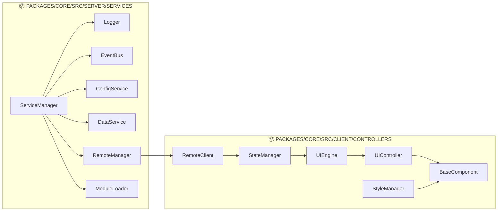

## 📁 **docs/id/API_REFERENCE.md** (REVISED)

<!--
OVHL CORE - API REFERENCE DOCUMENTATION
Document ID: API-001
Version: 1.0.0
Author: OVHL Core Team
Last Updated: 2025-10-27
License: MIT
-->

# 📚 OVHL CORE - API REFERENCE

## 📋 DOKUMEN INFORMASI

- **Document ID:** API-001
- **Version:** 1.0.0
- **Status:** Active
- **Author:** OVHL Core Team
- **Last Updated:** 28 Desember 2025
- **License:** MIT

## 🏠 REPOSITORY INFORMATION

- **GitHub:** https://github.com/ovhlstudio/ovhl-roblox
- **Core Package:** `/packages/core/`
- **Source:** `packages/core/src/`

## 🏗️ DIAGRAM RELASI SERVICE



## 🖥️ SERVER SERVICES API

### ServiceManager

**File:** `packages/core/src/server/services/ServiceManager.lua`

```lua
-- Initialize service manager
ServiceManager:Init() → boolean

-- Start all services
ServiceManager:Start() → boolean

-- Register new service
ServiceManager:RegisterService(serviceName: string, serviceModule: table) → boolean

-- Get service instance
ServiceManager:GetService(serviceName: string) → table
```

### Logger Service

**File:** `packages/core/src/server/services/Logger.lua`

```lua
-- Log with specific level
Logger:Log(level: string, message: string, data: table) → boolean

-- Convenience methods
Logger:Info(message: string, data: table) → boolean
Logger:Warn(message: string, data: table) → boolean
Logger:Error(message: string, data: table) → boolean
```

### EventBus Service

**File:** `packages/core/src/server/services/EventBus.lua`

```lua
-- Subscribe to events
EventBus:Subscribe(eventName: string, callback: function) → function

-- Emit events
EventBus:Emit(eventName: string, ...) → number

-- Unsubscribe
EventBus:Unsubscribe(eventName: string, callback: function) → boolean
```

## 📱 CLIENT CONTROLLERS API

### RemoteClient

**File:** `packages/core/src/client/controllers/RemoteClient.lua`

```lua
-- Invoke server function
RemoteClient:Invoke(eventName: string, ...) → any

-- Listen to server events
RemoteClient:Listen(eventName: string, callback: function) → RBXScriptConnection

-- Fire event to server
RemoteClient:Fire(eventName: string, ...) → boolean

-- Check connection status
RemoteClient:IsConnected() → boolean
```

### StateManager

**File:** `packages/core/src/client/controllers/StateManager.lua`

```lua
-- Set state value
StateManager:Set(key: string, value: any) → boolean

-- Get state value
StateManager:Get(key: string, defaultValue: any) → any

-- Subscribe to state changes
StateManager:Subscribe(key: string, callback: function) → function

-- Unsubscribe from state changes
StateManager:Unsubscribe(key: string, callback: function) → boolean
```

### UIEngine

**File:** `packages/core/src/client/controllers/UIEngine.lua`

```lua
-- Create component instance
UIEngine:CreateComponent(ComponentClass: table, props: table) → table

-- Mount component to parent
UIEngine:Mount(component: table, parent: Instance) → Instance

-- Unmount component
UIEngine:Unmount(component: table) → boolean

-- Connect event to component
UIEngine:Connect(component: table, signal: RBXScriptSignal, callback: function) → RBXScriptConnection
```

## 🎯 USAGE EXAMPLES

### Basic Service Registration

```lua
-- File: packages/core/src/server/modules/MyService.lua
local MyService = {}
MyService.__index = MyService

function MyService:Init()
    print("Service initialized")
    return true
end

-- Register in ModuleLoader atau init.server.lua
ServiceManager:RegisterService("MyService", MyService)
```

### Event Handling Pattern

```lua
-- Server side (packages/core/src/server/services/ atau modules/)
EventBus:Subscribe("PlayerJoined", function(player)
    print("Player joined:", player.Name)
end)

-- Client side (packages/core/src/client/controllers/ atau modules/)
RemoteClient:Listen("GameStateChanged", function(newState)
    StateManager:Set("gameState", newState)
end)
```

### UI Component Implementation

```lua
-- File: packages/core/src/client/modules/MyComponent.lua
local MyComponent = setmetatable({}, BaseComponent)

function MyComponent:Render()
    local frame = Instance.new("Frame")
    frame.Size = UDim2.new(1, 0, 1, 0)
    return frame
end

-- Usage in UIController
local component = UIEngine:CreateComponent(MyComponent, {})
UIEngine:Mount(component, parentFrame)
```

---

**Document History:**
| Version | Date | Author | Changes |
|---------|------|--------|---------|
| 1.0.0 | 2025-10-27 | OVHL Core Team | Initial release |
| 1.0.1 | 2025-10-27 | OVHL Core Team | Updated for actual repo structure |

**Repository:** https://github.com/ovhlstudio/ovhl-roblox  
**License:** MIT  
**Confidentiality:** Internal Use Only
