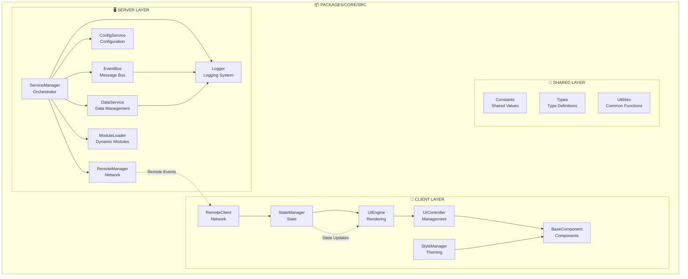

## 📁 **docs/id/ARCHITECTURE.md** (REVISED)

<!--
OVHL CORE - ARCHITECTURE DOCUMENTATION
Document ID: ARC-001
Version: 1.0.0
Author: OVHL Core Team
Last Updated: 2025-10-27
License: MIT
-->

# 🏗️ OVHL CORE - ARSITEKTUR SISTEM

## 📋 DOKUMEN INFORMASI

- **Document ID:** ARC-001
- **Version:** 1.0.0
- **Status:** Active
- **Author:** OVHL Core Team
- **Last Updated:** 28 Desember 2025
- **License:** MIT

## 🏠 REPOSITORY INFORMATION

- **GitHub:** https://github.com/ovhlstudio/ovhl-roblox
- **Core Package:** `/packages/core/`
- **Location:** `packages/core/src/`

## 📐 DIAGRAM ARSITEKTUR



## 🗂️ FILE STRUCTURE ACTUAL

```
packages/core/src/
├── 🖥️ server/
│   ├── services/
│   │   ├── ServiceManager.lua
│   │   ├── Logger.lua
│   │   ├── EventBus.lua
│   │   ├── ConfigService.lua
│   │   ├── DataService.lua
│   │   ├── RemoteManager.lua
│   │   └── ModuleLoader.lua
│   ├── modules/
│   │   └── GameManager.lua
│   └── init.server.lua
│
├── 📱 client/
│   ├── controllers/
│   │   ├── RemoteClient.lua
│   │   ├── StateManager.lua
│   │   ├── UIEngine.lua
│   │   ├── UIController.lua
│   │   └── StyleManager.lua
│   ├── modules/
│   │   └── HUD.lua
│   ├── lib/
│   │   └── BaseComponent.lua
│   └── init.client.lua
│
└── 🔗 shared/
    ├── constants/
    │   └── Constants.lua
    ├── types/
    └── utilities/
```

## 🔧 SPESIFIKASI CORE SERVICES

### ServiceManager

**Location:** `packages/core/src/server/services/ServiceManager.lua`
**Tujuan:** Orchestrasi service dan manajemen lifecycle
**Method:**

- `Init()`: Inisialisasi registry service
- `Start()`: Start semua service yang terdaftar
- `RegisterService(name, module)`: Daftarkan service baru
- `GetService(name)`: Ambil instance service

### DataService

**Location:** `packages/core/src/server/services/DataService.lua`
**Tujuan:** Persistensi data dan manajemen
**Method:**

- `RegisterDataStore(name, defaults)`: Setup data store
- `GetPlayerData(player, store)`: Ambil data player
- `SetPlayerData(player, store, data)`: Simpan data player

### RemoteManager

**Location:** `packages/core/src/server/services/RemoteManager.lua`
**Tujuan:** Komunikasi client-server
**Method:**

- `RegisterHandler(event, callback)`: Daftarkan event handler
- `FireClient(player, event, data)`: Kirim ke client tertentu
- `FireAllClients(event, data)`: Broadcast ke semua client

## 🎨 ARSITEKTUR UI

### Component Lifecycle

```
Init() → Render() → DidMount() → [State Updates] → WillUnmount()
```

### State Management

```lua
-- Reactive state system
StateManager:Set("key", value) -- Trigger updates
StateManager:Subscribe("key", callback) -- Listen changes
```

## 🔄 ALUR DATA

### Client → Server

```
Client Event → RemoteClient → RemoteManager → Event Handler → Service Logic
```

### Server → Client

```
Service Logic → RemoteManager → RemoteClient → StateManager → UI Update
```

## 🛡️ STRATEGI ERROR HANDLING

### 1. Defensive Programming

- Semua operasi berisiko dibungkus pcall()
- Nil checks sebelum operasi

### 2. Graceful Degradation

- Services tetap berjalan jika dependencies gagal
- Fallback mechanisms untuk fungsi kritis

### 3. Comprehensive Logging

- Structured logs dengan context information
- Error tracking dan reporting

---

**Document History:**
| Version | Date | Author | Changes |
|---------|------|--------|---------|
| 1.0.0 | 2025-10-27 | OVHL Core Team | Initial release |
| 1.0.1 | 2025-10-27 | OVHL Core Team | Updated for actual repo structure |

**Repository:** https://github.com/ovhlstudio/ovhl-roblox  
**License:** MIT  
**Confidentiality:** Internal Use Only
