## 📁 **docs/id/DEVELOPMENT_STANDARDS.md**

<!--
OVHL CORE - DEVELOPMENT STANDARDS DOCUMENTATION
Document ID: DEV-001
Version: 1.0.0
Author: OVHL Core Team
Last Updated: 2025-10-27
License: MIT
-->

# 📋 OVHL CORE - DEVELOPMENT STANDARDS

## 📋 DOKUMEN INFORMASI

- **Document ID:** DEV-001
- **Version:** 1.0.0
- **Status:** Active
- **Author:** OVHL Core Team
- **Last Updated:** 28 Desember 2025
- **License:** MIT

## 🏠 REPOSITORY INFORMATION

- **GitHub:** https://github.com/ovhlstudio/ovhl-roblox
- **Core Package:** `/./`
- **Tools Package:** `/packages/tools/` (Coming Soon)

## 🏷️ VERSIONING STANDARDS

### Semantic Versioning (SemVer)

```mermaid
graph LR
    A[Version] --> B[MAJOR.MINOR.PATCH]
    B --> C[Breaking Changes]
    B --> D[New Features]
    B --> E[Bug Fixes]

    C --> C1[1.0.0 → 2.0.0]
    D --> D1[1.0.0 → 1.1.0]
    E --> E1[1.0.0 → 1.0.1]
```



**Format:** `MAJOR.MINOR.PATCH`

- **MAJOR** - Breaking changes (1.0.0 → 2.0.0)
- **MINOR** - New features, backward compatible (1.0.0 → 1.1.0)
- **PATCH** - Bug fixes (1.0.0 → 1.0.1)

### Branch Naming Convention


**Branch Patterns:**

- `feature/description` - New features
- `fix/description` - Bug fixes
- `hotfix/description` - Critical fixes
- `release/version` - Release preparation
- `docs/description` - Documentation updates

## 📝 NAMING CONVENTIONS

### File & Folder Naming


### Code Naming Standards

```lua
-- ✅ CORRECT NAMING

-- Services: PascalCase
ServiceManager, DataService, Logger

-- Methods: PascalCase
Init(), Start(), GetPlayerData()

-- Variables: camelCase
playerData, serviceInstance, isConnected

-- Events: PascalCase + Category
PlayerJoined, GameStateChanged, UIScreenOpened

-- Constants: UPPER_SNAKE_CASE
MAX_PLAYERS, DEFAULT_COINS, API_TIMEOUT

-- File Names: kebab-case
service-manager.lua, remote-client.lua
```

## 🏗️ CODE STRUCTURE STANDARDS

### File Organization


### Service Pattern Template

```lua
-- File: ./src/server/services/ServiceName.lua
local ServiceName = {}
ServiceName.__index = ServiceName

function ServiceName:Init()
    self.initialized = true
    self.data = {}
    return true
end

function ServiceName:Start()
    -- Setup event listeners
    local EventBus = ServiceManager:GetService("EventBus")
    EventBus:Subscribe("SomeEvent", function(...)
        self:HandleEvent(...)
    end)
    return true
end

function ServiceName:SomeMethod(param1, param2)
    local success, result = pcall(function()
        -- Business logic here
        return someOperation(param1, param2)
    end)

    if not success then
        Logger:Error("Method failed", {error = result})
        return false, result
    end

    return true, result
end

return ServiceName
```

## 🎨 CODE STYLE GUIDELINES

### Indentation & Formatting

```lua
-- ✅ CORRECT FORMATTING

-- Use 4 spaces for indentation
local function CalculateDamage(attacker, target)
    local baseDamage = attacker:GetDamage()
    local defense = target:GetDefense()

    -- Proper spacing around operators
    local finalDamage = math.max(1, baseDamage - defense)

    return finalDamage
end

-- ❌ INCORRECT FORMATTING
local function dmg(a,t)
local x=a:getDmg()
local y=t:getDef()
return math.max(1,x-y)
end
```

### Error Handling Standards


```lua
-- ✅ PROPER ERROR HANDLING

-- All risky operations wrapped in pcall
local success, result = pcall(function()
    return riskyOperation(data)
end)

if not success then
    -- Comprehensive error logging
    Logger:Error("Operation failed", {
        operation = "riskyOperation",
        error = result,
        data = data
    })

    -- Graceful fallback
    return fallbackValue
end

return result
```

## 🔄 GIT WORKFLOW STANDARDS

### Commit Message Convention


**Commit Format:** `type(scope): description`

**Examples:**

- `feat(auth): add player authentication system`
- `fix(network): resolve remote connection timeout`
- `docs(api): update service method documentation`
- `refactor(ui): simplify component lifecycle`

### Pull Request Standards


**PR Requirements:**

- ✅ All tests passing
- ✅ Code follows standards
- ✅ Documentation updated
- ✅ No breaking changes
- ✅ Peer review completed

## 🧪 TESTING STANDARDS

### Test Structure

```lua
-- File: ./tests/services/test-service-manager.lua
local ServiceManager = require("packages.core.src.server.services.ServiceManager")

describe("ServiceManager", function()
    before_each(function()
        -- Setup test environment
    end)

    it("should initialize services", function()
        local manager = setmetatable({}, ServiceManager)
        local success = manager:Init()

        expect(success).to.equal(true)
        expect(manager.services).to.be.a("table")
    end)

    it("should handle service registration", function()
        local manager = setmetatable({}, ServiceManager)
        manager:Init()

        local mockService = { Init = function() return true end }
        local success = manager:RegisterService("TestService", mockService)

        expect(success).to.equal(true)
        expect(manager:GetService("TestService")).to.equal(mockService)
    end)
end)
```

## 📊 PERFORMANCE STANDARDS

### Memory Management

```lua
-- ✅ EFFICIENT MEMORY USAGE

-- Avoid memory leaks in event listeners
function Component:DidMount()
    self._connections = {}

    -- Store connections for cleanup
    table.insert(self._connections, someSignal:Connect(function()
        -- Handler logic
    end))
end

function Component:WillUnmount()
    -- Cleanup all connections
    for _, connection in ipairs(self._connections) do
        connection:Disconnect()
    end
    self._connections = {}
end

-- Use object pooling for frequent creations
local objectPool = {}
local function GetFromPool()
    if #objectPool > 0 then
        return table.remove(objectPool)
    end
    return CreateNewObject()
end
```

### Performance Guidelines

- ✅ Use object pooling for frequent Instance creation
- ✅ Minimize table allocations in hot paths
- ✅ Cache frequently accessed values
- ✅ Avoid expensive operations in loops
- ✅ Use appropriate data structures

## 🔧 TOOLING & AUTOMATION

### Development Tools


### Automated Checks

- **Linting** - Selene for code quality
- **Formatting** - Consistent code style
- **Testing** - Automated test suites
- **Build Verification** - Rojo build checks

---

**Document History:**
| Version | Date | Author | Changes |
|---------|------|--------|---------|
| 1.0.0 | 2025-10-27 | OVHL Core Team | Initial release |

**Repository:** https://github.com/ovhlstudio/ovhl-roblox  
**License:** MIT  
**Confidentiality:** Internal Use Only
