## 📁 **docs/id/SETUP_GUIDE.md** (REVISED)

<!--
OVHL CORE - SETUP GUIDE DOCUMENTATION
Document ID: SET-001
Version: 1.0.0
Author: OVHL Core Team
Last Updated: 2025-10-27
License: MIT
-->

# 🛠️ OVHL CORE - SETUP GUIDE

## 📋 DOKUMEN INFORMASI

- **Document ID:** SET-001
- **Version:** 1.0.0
- **Status:** Active
- **Author:** OVHL Core Team
- **Last Updated:** 28 Desember 2025
- **License:** MIT

## 🏠 REPOSITORY INFORMATION

- **GitHub:** https://github.com/ovhlstudio/ovhl-roblox
- **Main Package:** `/./`
- **Tools Package:** `/packages/tools/` (Coming Soon)

## 🗺️ DIAGRAM SETUP PROCESS

```mermaid
flowchart TD
    A[🚀 Start Setup] --> B[Clone Repository]
    B --> C[Navigate to Core Package]
    C --> D[Install Rojo]
    D --> E[Setup Development Environment]
    E --> F[Test Setup]
    F --> G{Test Successful?}
    G -->|Yes| H[✅ Setup Complete]
    G -->|No| I[🔄 Troubleshoot]
    I --> F

    subgraph B[Clone Repository]
        B1[git clone<br/>ovhl-roblox]
        B2[cd ovhl-roblox]
    end

    subgraph C[Navigate to Core]
        C1[cd .]
    end
```



## 📋 PREREQUISITES

### System Requirements

- **Roblox Studio** versi terbaru
- **Rojo 7.x** atau versi lebih baru
- **Git** untuk version control

### Development Tools

- **Visual Studio Code** dengan extension Luau
- **Rojo plugin** untuk Roblox Studio
- **Terminal/Command Prompt**

## 🚀 QUICK START

### Step 1: Clone Repository

```bash
# Clone the main repository
git clone https://github.com/ovhlstudio/ovhl-roblox.git
cd ovhl-roblox
```

### Step 2: Navigate to Core Package

```bash
# Navigate to the core framework package
cd .
```

### Step 3: Install Dependencies

```bash
# Install Rojo (jika belum ada)
cargo install rojo

# Verify installation
rojo --version
```

### Step 4: Setup Project

```bash
# Serve project ke Roblox Studio dari folder core
rojo serve default.project.json
```

### Step 5: Test Setup

```mermaid
sequenceDiagram
    participant Dev as Developer
    participant Rojo as Rojo Server
    participant Studio as Roblox Studio
    participant Game as Test Game

    Dev->>Rojo: rojo serve (from .)
    Rojo->>Studio: Sync Core Files
    Dev->>Studio: Open Project
    Studio->>Game: Play Test
    Game->>Dev: Check Console Output
    Note over Dev,Game: ✅ OVHL Core Bootstrap Messages
```



## 🏗️ PROJECT STRUCTURE (ACTUAL REPO)

```mermaid
graph TD
    A[ovhl-roblox/] --> B[packages/]
    A --> C[examples/]
    A --> D[docs/]
    A --> E[README.md]

    B --> F[core/]
    B --> G[tools/]

    F --> F1[src/]
    F --> F2[default.project.json]
    F --> F3[README.md]

    F1 --> F1A[server/]
    F1 --> F1B[client/]
    F1 --> F1C[shared/]

    F1A --> F1A1[services/]
    F1A --> F1A2[modules/]
    F1A --> F1A3[init.server.lua]

    F1B --> F1B1[controllers/]
    F1B --> F1B2[modules/]
    F1B --> F1B3[lib/]
    F1B --> F1B4[init.client.lua]

    G --> G1[🚧 Coming Soon]
    G --> G2[Node.js SDK]
    G --> G3[CLI Tools]
```



## 🔧 DEVELOPMENT WORKFLOW

### 1. Start Development Session

```bash
# Terminal 1: Navigate to core package dan serve
cd .
rojo serve default.project.json

# Terminal 2: Build untuk production
rojo build --output ../../build/game.rbxlx
```

### 2. Code Structure Guidelines


### 3. Testing Procedures

```lua
-- Manual testing checklist (run setelah setup)
local testChecklist = {
    serverBootstrap = "✅ 6 services loaded without errors",
    clientConnection = "✅ RemoteClient connected to server",
    uiRendering = "✅ HUD component rendered properly",
    communication = "✅ Client-server events working",
    errorHandling = "✅ Graceful error recovery"
}
```

## 🐛 TROUBLESHOOTING

### Common Issues & Solutions


### Debug Mode:

```lua
-- Enable debug logging di console
Logger:Info("Setup verification", {
    location = ".",
    services = ServiceManager:GetServiceCount(),
    connected = RemoteClient:IsConnected()
})
```

## 🔮 FUTURE SETUP (OVHL TOOLS)

### Coming Soon - OVHL Tools CLI

```bash
# Future setup dengan OVHL Tools
npx @ovhlstudio/tools create my-game
cd my-game
ovhl dev  # Auto setup development environment
```

## 🎯 VERIFICATION CHECKLIST

- [ ] **Repository cloned** - dari https://github.com/ovhlstudio/ovhl-roblox
- [ ] **Correct location** - working di `./` folder
- [ ] **Rojo installation** - `rojo --version` returns version
- [ ] **Server bootstrap** - no errors in console (6 services loaded)
- [ ] **Client connection** - RemoteClient connects successfully
- [ ] **UI rendering** - HUD component appears
- [ ] **Communication** - client-server events work

---

**Document History:**
| Version | Date | Author | Changes |
|---------|------|--------|---------|
| 1.0.0 | 2025-10-27 | OVHL Core Team | Initial release |
| 1.0.1 | 2025-10-27 | OVHL Core Team | Updated for actual repo structure |

**Repository:** https://github.com/ovhlstudio/ovhl-roblox  
**License:** MIT  
**Confidentiality:** Internal Use Only
