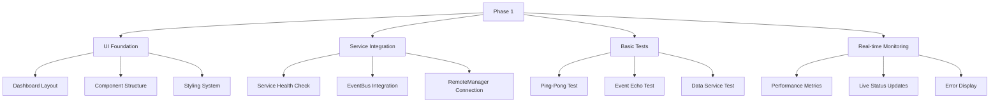
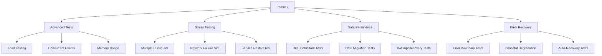
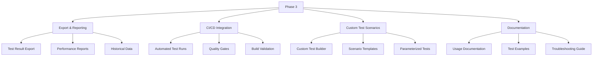

# 🚀 OVHL TEST DASHBOARD - MASTER IMPLEMENTATION PLAN

## 📋 PROJECT OVERVIEW

**Objective:** Build comprehensive testing dashboard for OVHL Core Framework  
**Timeline:** 3 Phase approach (1-2 weeks total)  
**Priority:** High - Provides immediate development value and documentation

## 🎯 PHASE 1: FOUNDATION (Week 1)

### **Goal:** Basic Test Dashboard with Core Functionality



### **Phase 1 Checklist:**

- [ ] **Create TestDashboard.lua** component
- [ ] **Implement dashboard UI layout** with sections:
  - [ ] Service Status Panel
  - [ ] Test Controls Panel
  - [ ] Results Display
  - [ ] Performance Metrics
- [ ] **Integrate with ServiceManager** for health checks
- [ ] **Implement basic tests**:
  - [ ] Ping-Pong (client-server round trip)
  - [ ] Event Echo (EventBus functionality)
  - [ ] Data Service Mock Test
- [ ] **Add real-time metrics**:
  - [ ] Connection status
  - [ ] Service response times
  - [ ] Event latency
- [ ] **Error handling** and result display

### **Expected Deliverables Phase 1:**

✅ Working dashboard UI  
✅ Real-time service monitoring  
✅ 3 basic test functionalities  
✅ Performance metrics display  
✅ Error handling and user feedback

## 🎯 PHASE 2: ADVANCED TESTING (Week 1-2)

### **Goal:** Comprehensive Testing Suite



### **Phase 2 Checklist:**

- [ ] **Advanced test scenarios**:
  - [ ] Load testing (100+ simultaneous events)
  - [ ] Concurrent user simulation
  - [ ] Memory usage monitoring
- [ ] **Stress testing utilities**:
  - [ ] Network failure simulation
  - [ ] Service restart recovery tests
  - [ ] High-load scenario testing
- [ ] **Data persistence tests**:
  - [ ] Real DataStore integration tests
  - [ ] Data migration scenarios
  - [ ] Backup and recovery procedures
- [ ] **Error recovery testing**:
  - [ ] Error boundary validation
  - [ ] Graceful degradation verification
  - [ ] Auto-recovery mechanisms

### **Expected Deliverables Phase 2:**

✅ Comprehensive test suite  
✅ Stress testing capabilities  
✅ Data persistence validation  
✅ Error recovery verification  
✅ Performance benchmarking

## 🎯 PHASE 3: PRODUCTION READY (Week 2)

### **Goal:** Enterprise Features & Integration



### **Phase 3 Checklist:**

- [ ] **Export and reporting**:
  - [ ] Test result export (JSON/CSV)
  - [ ] Performance trend analysis
  - [ ] Historical data storage
- [ ] **CI/CD integration**:
  - [ ] Automated test execution
  - [ ] Quality gates for deployments
  - [ ] Build validation tests
- [ ] **Custom test scenarios**:
  - [ ] Visual test builder
  - [ ] Pre-built scenario templates
  - [ ] Parameterized test configurations
- [ ] **Complete documentation**:
  - [ ] User guide for test dashboard
  - [ ] Example test scenarios
  - [ ] Troubleshooting and debugging guide

### **Expected Deliverables Phase 3:**

✅ Enterprise-ready test dashboard  
✅ Automated testing pipeline  
✅ Custom test scenario builder  
✅ Comprehensive documentation  
✅ Production deployment ready

## 🛠️ TECHNICAL IMPLEMENTATION DETAILS

### **File Structure:**

```
packages/core/src/
├── client/
│   ├── modules/
│   │   └── TestDashboard.lua              # Main dashboard component
│   └── lib/
│       ├── TestRunner.lua                 # Test execution engine
│       └── PerformanceMonitor.lua         # Metrics collection
├── server/
│   └── modules/
│       ├── TestService.lua                # Server-side test handlers
│       └── StressTestService.lua          # Stress testing utilities
└── shared/
    └── types/
        └── TestTypes.lua                  # Test type definitions
```

### **Key Components:**

1. **TestDashboard** - Main UI component
2. **TestRunner** - Test execution and management
3. **PerformanceMonitor** - Real-time metrics collection
4. **TestService** - Server-side test handlers
5. **StressTestService** - Advanced testing utilities

### **Test Types to Implement:**

- ✅ **Connectivity Tests** - Network and service connections
- ✅ **Performance Tests** - Latency and response times
- ✅ **Functionality Tests** - Core feature validation
- ✅ **Stress Tests** - High-load scenarios
- ✅ **Recovery Tests** - Error and failure handling
- ✅ **Integration Tests** - Cross-service functionality

## 📊 SUCCESS METRICS

### **Phase 1 Success Criteria:**

- Dashboard loads without errors
- All 3 basic tests execute successfully
- Real-time metrics update correctly
- Error handling works for failed tests
- UI is responsive and user-friendly

### **Phase 2 Success Criteria:**

- Advanced tests provide meaningful insights
- Stress testing identifies performance limits
- Data persistence tests validate storage
- Error recovery mechanisms function correctly
- Memory usage stays within acceptable limits

### **Phase 3 Success Criteria:**

- Test results can be exported and analyzed
- Automated tests integrate with development workflow
- Custom test scenarios are easy to create and execute
- Documentation is comprehensive and accurate
- Dashboard is production-ready and reliable

## 🚀 ONBOARDING FOR NEW SESSIONS

### **If Chat Session Resets:**

```
CONTEXT: OVHL Core Test Dashboard Implementation
CURRENT STATUS: [Check DEV_LOGS.md for latest phase]
REPOSITORY: https://github.com/ovhlstudio/ovhl-roblox

LATEST PROGRESS:
- Phase: [X] Completed
- Current Focus: [Phase Y - Specific Task]
- Next Priority: [Next immediate action item]

KEY FILES:
- packages/core/src/client/modules/TestDashboard.lua
- packages/core/src/client/lib/TestRunner.lua
- packages/core/src/server/modules/TestService.lua

RECENT DECISIONS:
1. Using comprehensive dashboard approach (not simple 3-button)
2. 3-phase implementation plan
3. Real-time metrics and monitoring focus
```

### **Quick Status Check Commands:**

- "Status TestDashboard" - Current implementation status
- "Next TestDashboard task" - Immediate next action item
- "TestDashboard blockers" - Current issues or decisions needed
- "TestDashboard phase [X]" - Switch focus to specific phase

## 🔄 ADAPTIVE PLANNING

### **Flexibility Points:**

- Phase duration may adjust based on complexity
- Feature priority can shift based on user feedback
- Technical constraints may require approach changes
- Team availability may affect implementation speed

### **Risk Mitigation:**

- Regular progress checkpoints
- Early user testing and feedback
- Modular implementation for easy adjustments
- Comprehensive error handling from start

---

## 📋 MASTER CHECKLIST SUMMARY

### **PHASE 1 - FOUNDATION**

- [ ] TestDashboard UI component
- [ ] Service health monitoring
- [ ] Basic test functionalities
- [ ] Real-time metrics display
- [ ] Error handling system

### **PHASE 2 - ADVANCED TESTING**

- [ ] Load and stress testing
- [ ] Data persistence validation
- [ ] Error recovery testing
- [ ] Performance benchmarking
- [ ] Memory usage monitoring

### **PHASE 3 - PRODUCTION READY**

- [ ] Export and reporting features
- [ ] CI/CD integration
- [ ] Custom test scenarios
- [ ] Comprehensive documentation
- [ ] Production deployment
